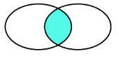
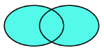
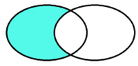
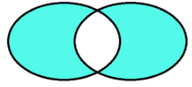

# Nomenclature
<https://peps.python.org/pep-0008/>

Style guide with propositions on how to make code more readable
# Defining Your Own Functions
It is extremely important to keep code well documented and commented. One of the this that can be done to further improve readability is through the use of docstrigs

`	`Ex)

`	`def functionA( varA , varB, … ) :

`		`“””

`		`Does x using y and z

`		`Variables:

`		`varA - …

`		`varB - …

`		`(…)

`		`“””

`		`Body of the function
# Libraries
Operational packages - Load, structure and prepare datasets

- Pandas – Data Analysis cornerstone
- Numpy – Numeric library that serves as foundation for all calculations
- Scipy – Advanced scientific computing, optimization, linear algebra, image processing and more
- Statsmodels – Advanced statistical functions

Data Visualization packages – Visualize data through graphics

- Matplotlib – Foundational library for visualizations, good for quick graphs
- Seaborn – Easier to make visualizations, built on top of matplotlib
- Plotly – Presentation quality visualizations + Some interactive elements
- Bokeh – Allows the making of interactive charts

Machine Learning

- Scikit-learn – Common machine learning library
# Jupyter Notebooks
Shortcuts:

- A – add cell above
- B – add cell below
- DD – delete cell
- ` `ENTER – Edit cell mode
- ESC – Exit cell edit mode
- CTRL + ENTER – Run current cell
- SHIFT + ENTER – Run current cell and move to next
- X – Cut a cell
- V – Paste a cell
# Basic Python
There are multiple tidbits that can be useful to know and help with day/to/day coding:

The range() function can have multiple inputs:

`	`range( start\_point , end\_point , step )

- Start\_point – first number, is included
- End\_point – last number, isn’t included
- Step – increment to be used

For loops actually assign to the variable used and store its value after the loop’s completion:

Ex) In the following code

[ x for x in range(5) ]

print(x) will return a 4
# Datatype Hierarchy
In some cases there are functions/methods that only accept a single datatype, and will forcibly convert the elements according to the following hierarchy;

`	`**Boolean** → **Integer** → **Float** → **Strings**

`	`Boolean: True is converted to 1 , 1.0 or ‘True’

`	`Integer: 5 is converted to 5.0 or ‘5’

`	`Float: 7.9 is converted to ‘7.9’

Depending on the element with the highest hierarchy present in the collection.
# Strings
Useful tidbits and methods:

You can check if a substring is within a string with

`	`substring\_x in string\_x

You can multiply strings to append the same string into a larger string

`	`Ex) ‘Hello’\*3 → ‘HelloHelloHello’

Escape character: \

`	`Ex) print(‘\”’) prints a  single “

New-line: \n

If you want to know the position a substring appears the first time:

`	`string\_x.index( ‘substring’ )

`	`\*NOTE: Method will throw an error if substring isn’t within the string

On the other hand, the .find() method does the same, but returns -1 if the substring isn’t present:

`	`string\_x.find( ‘substring’ )

If you want to count how many times a substring appears in either a string or it’s slice, use:

`	`string\_x.count( ‘substring’ , slice\_start , slice\_end )

You can also replace one or more occurrences of a substring within a string:

`	`string\_x.replace( ‘old\_substring’ , ‘new\_substring’, int )

If you don’t use the last int arg, all instances of the substring will be replaced

Otherwise only the first int instances will be replaced

If you want to concatenate strings using a certain separator you can use:

`	`‘separator’.join( [ list of strings ] )

If you want to split a string into a tuple of strings using a certain separator, use:

`	`string\_x.partition( ‘separator’ )

If you want a list of strings instead use:

`	`string\_x.split( ‘separator’ )

You can create modular strings through the use of {} brackets and the .format() method:

`	`Ex)

`	`x , y = ‘Miguel’ , ‘Soares’

`	`string\_x = ‘My first name is {n\_1} and my last {n\_2}’.format( n\_1 = x , n\_2 = y )

\*NOTE: You can also not add anything between the brackets, but in that case the arguments that appear in the format will be added in the same order as inputted, OR you can use integers to index which arguments are to be used:

`	`Ex)

`	`‘{} {}’.format(‘A’, ‘B’) → ‘A B’

`	`‘{1} {0}’.format(‘A’,’B’) → ‘B A’

\*NOTE: Only by using names or indexes can you have a different number of {} brackets vs format() arguments

\*NOTE: You can further format the string by using certain commands:

`	`{n\_1:.int} – The number shown will have int characters

`	`{n\_1:.intf} – The number shown will have int decimal characters

{n\_1:.inte} – The number shown will be in scientific notation and have int decimal cases

{n\_1:.int%} – The number shown will be multiplied by 100, have int decimal cases and an % at the end

{n\_1:>int} – The substring added’ end is aligned with int characters further to the right

`	`Ex) ‘Age: {‘24’:>6}’ → Age: \_  \_  \_  \_ 2 4

`				       `1 2 3 4 5 6

Another option to embed expressions into strings is by using f-strings:

`	`var\_x, var\_y = A , B

`	`fstring\_a = f”var\_x’s value is {var\_x}, and var\_y’s value is {var\_y}”

You can also do something similar with the modulo operator

`	`Ex) ‘%.2f’ % 3.145….

`	`Look at the documentation for further information
# Lists
Useful tidbits and methods:
## Adding, Removing & Changing Objects From a List
Most list methods that are called on an object will in fact alter it and override its memory.
### Add
Use the .append() method to add to the end of a list:

`	`list\_x.append( var\_a )

To add an object in a specific place use:

`	`list\_x.insert( int , var\_a )

`	`Where int is the position where the new object should be in the list

You can also both add lists:

`	`Ex)

list\_a = [ ‘a’ , ‘b’ ]	;	list\_b = [ ‘1’ , ‘2’ ]

list\_a + list\_b → [ ‘a’ , ‘b’ , ‘1’, ‘2’ ]

And multiply them with an integer:

`	`list\_a \* 3 → [ ‘a’ , ‘b’ , ‘a’ , ‘b’ , ‘a’ , ‘b’ ]

`	`\*NOTE: You can neither divide OR subtract a list
### Remove
To delete the first instance of an object use:

`	`list\_x.remove( var\_a )

\*NOTE: Trying to remove an object that doesn’t exist from a list will push an error

To delete an object in a list by its index use:

`	`list\_x.pop( int )

To completely clear a list (same as reassigning it lo list() ) use the method:

`	`list\_x.clear()
### Change
Lists, as a mutable object, can also be updated by index:

`	`list\_x[ int ] = var\_a

To sort a list in ascending or descending order use:
`	`list\_x.sort( reverse = bool )

`	`Where, by default reverse = False and the methods sorts in ascending order
## Others
To see how many instances of an object are present in a list use:
`	`list\_x.count( var\_a )
# Tuples
Useful tidbits, methods and functions:

Using the zip() function you can create an **iterator** (an iterable object) to join the elements of each by index in tuples:

`	`Ex)

`	`list\_a = …	;	list\_b = …

`	`list( zip( list\_a , list\_b ) ) → [ ( list\_a[0] , list\_b[0] ) , ( list\_a[1] , list\_b[1] ) , … ]

You can also use the enumerate function to do something similar, but with a list and its corresponding indexes:

`	`Ex)

`	`list\_a = …	

`	`list( enumerate( list\_a, int ) ) → [ ( 0 , list\_a[0] ) , ( 1 , list\_a[1] ) , … ]

Where by default int is 0 and declares what is the initial index to be used for the first element of the iterator

# Dictionaries
Useful tidbits, methods and functions:

Dictionary keys can only be immutable data types like strings, numbers and tuples
# Sets
A lesser used datatype for data storage, sets are able to store different datatypes, are mutable, unordered, unchangeable, unindexed and don’t allow duplicates

Sets, since they don’t allow duplicates, are very useful when trying to examine what are the UNIQUE elements of a data structure.

\*NOTE: In some cases like True & 1 and False & 0, sets consider them as the same and as such only one will be kept

Sets can be instantiated with:

`	`set( list/tuple/string )

Or simply manual assignment like:

`	`set\_a = { 1 , a , ‘hello’ }

\*NOTE: sets cannot be manually created empty as {} defaults to an empty dictionary

You can add elements to a set with:

`	`set\_a.add( set\_element )

Sets are largely optimized for detecting whether an element is in it and make comparisons between the elements in each set (like a venn diagram).

If you want to know what elements appear between the two sets use:

	set\_a.intersection( set\_b , … )

`	`OR

`	`set\_a & set\_b & …

If you want to know all the elements of a group of sets merged together use:

`	`set\_a.union( set\_b , … )

OR

`	`set\_a | set\_b | …

If you want to remove the elements of a set from another and see whats left use:

	set\_a.difference( set\_b , … )

OR

`	`set\_a - set\_b - …

\*NOTE: This is the only one where ordering matters as the first set is the one being subtracted.

If you want to know all the elements that are not in both sets use:

	set\_a.symmetric\_difference( set\_b , … )

OR

`	`set\_a ^ set\_b ^ …

# Datetime
Module for working with datetime data:

`	`import datetime

Many datetime functions will require you to specify what components of a datetime object you’re looking for. The string characters for each component can be found below:

|Code|Format|Example|
| :-: | :-: | :-: |
|%a|Abbreviated weekday|Sun|
|%A|Weekday|Sunday|
|%b|Abbreviated month|Jan|
|%B|Month name|January|
|%c|Date and time|Sun Jan 1 00:00:00 2021|
|%d|Day (leading zeros)|01 to 31|
|%H|24 hours|00 to 23|
|%I|12 hours|01 to 12|
|%j|Day of year|001 to 366|
|%m|Month|01 to 12|
|%M|Minute|00 to 59|
|%p|AM or PM|AM/PM|
|%S|Seconds|00 to 61|
|%U|Week number (Sun)|00 to 53|
|%W|Week number (Mon)|00 to 53|
|%w|Weekday|0 to 6|
|%x|Locale’s appropriate date representation|
08/16/88 (None);

08/16/1988 (en\_US);

16\.08.1988 (de\_DE)
|
|%X|A locale’s appropriate time representation|
21:30:00 (en\_US);

21:30:00 (de\_DE)
|
|%y|Year without century|00 to 99|
|%Y|Year|2022|
|%z|Offset|+0900|
|%Z|Time zone|EDT/JST/WET etc (GMT)|

Instantiate datetime variables with:

`	`date\_a = datetime.date( year , month , day )

`	`datetime\_a = datetime.datetime( year , month , day , hour , minute , second )

You can also use a string to create a datetime object or vice-versa using:

datetime.strptime( ‘ date\_string ‘ , ‘ components code in format ‘ )

To create a datetime object

`	`Ex)

`	`datetime\_a = datetime.strptime( ‘25/11/2012’ , ‘%d/%m/%Y’ )

AND

datetime.strftime( datetime , ‘ components code in desired format ’ )

To create a string from a datetime object

You can also transform strings/datetime objects into timestamps (Unix time, basically counts how many seconds have passes since 1st Jan 1970):

`	`datetime.timestamp( datetime )

AND vice-versa

datetime.fromtimestamp( timestamp )

If you want to access a single part of the datetime you can use the attributes:

`	`datetime\_a.datetime.datetime\_component

where datetime\_component may be year/month/day/hour/minute/second

You can also establish a time delta using:

`	`datetime.timedelta(

days = int ,

seconds = int ,

microseconds = int ,

milliseconds = int ,

minutes = int ,

hours = int ,

weeks = int )

`	`Ex) time\_delta = datetime.timedelta( days = 30 )

`	`Which you can use to add or subtract from date/datetime objects

Time-Zones can also be included:

`	`Look further in the documentation

\*NOTE: Both NumPy and Pandas have developed their own datatime classes that further boost performance, so although you can use the default datetime object it is oftentimes better to work with their classes.

`	`NumPy: datetime64 , timedelta64 , …

`	`Pandas: Timestamp , Timedelta , Period , DateOffset
# Math
Provides access to multiple mathematical functions:

`	`import math

like:

`	`math.exp( num )		same as 	e\*\*num

math.log( num )		same as 	ln( num )

math.factorial( int )		same as 	int !

math.sqrt( num )
# Random
Provides access to pseudo-random functions:

import random

like:

`	`random.random()

`	`random.choice( [ choice\_a , choice\_b , … ] )

`	`random.randint( first\_int , last\_int )
# NumPy
Python inherently isn’t the best for processing, as such NumPy was developed as a very efficient numeric processing library. Although you wont mess with it directly as often, a great range of libraries like pandas are built atop it and rely on it to process data.

import numpy as np

The most important feature of numpy comes from vectorization, allowing operations to be performed on multiple components of an object at the same time.

One of the core datatypes available to numpy are N-dimensional arrays:

`	`array\_a = np.array( list/tuple )

\*NOTE: All elements of an array must be of the same datatype, or will be forcibly converted according to the datatype hierarchy.

To check the datatype of an array use the dtype attribute:

`	`array\_a.dtype

Arrays can make matrices of infinite dimensions but are constructed as the following.

`	`Single number  → point

`	`List [a , a] → 1D matrix

`	`List of Lists [ [a , a] , [b, b] ] → 2D matrix

`	`List of Lists of Lists [  [ [a , a] , [b, b] ] , [ [c , c] , [d, d] ]  ] → 3D matrix

`	`…

\*NOTE: Think of it as with each additional structure, adding in a new dimension. For example adding multiple dots ( a list ) expands the array into a single dimension, adding a new list expands the array into the 2nd dimension, adding a list of lists will in turn expand the array into the 3rd dimension, and so on, and so on.

You can also create an array with only zeroes, ones, or a single element by using:

`	`np.zeroes( int, int , … )

`	`OR

`	`np.ones( int, int , … )

OR

np.full( ( int, int , … ) , var )

`	`Where the ints represent how many layers each dimension will have

To check how many dimensions an array has, use the ndim attribute:

`	`array\_a.ndim

And to check how many layers in each dimension use the shape attribute:

`	`array\_a.shape

You can also reshape arrays into different dimensions with the .reshape() method, as long as the total number of elements of the new dimensions matrix is the same as the previous:

`	`array\_b = array\_a.reshape( int , int , … )

`	`Where the ints represent how many layers each dimension will have

\*NOTE: This reshaping will keep the base order of the array’s elements, but can transform, for example a 2D 4x2 matrix into a 3D 2x2x2

`	`There is also the .flatten() method, which reshapes into a single dimension

And transpose arrays ( rows to columns and vice-versa ) using the attribute:

`	`array\_transposed = array\_a.T

\*NOTE: It works as intended in 2D arrays, but arrays with higher dimensions start being weirder

Arrays are also mutable and can be indexed:

`	`Ex)

`	`np.array( [ 1 , 5 , 7 ] )[0] = 3 → array( [ 3 , 5 , 7 ] )

Arrays allow operations like addition, multiplication, etc.. to be performed throughout the elements of the array

`	`Ex)

`	`np.array( [ 1 , 2 , 3 ] ) \*\* 2  → array( [ 1 , 4 , 9 ] )

You can also preform these operations with multiple arrays, but for this both need to have the same dimensions.

Ex)

np.array( [ 1 , 2 , 3 ] ) \* np.array( [ 5 , 4 , 1 ] ) → array( [5 , 8 , 3 ] )

You can also do the same with comparison operators like:

`	`np.array( [ 1 , 2 , 3 ] ) == 1 → array( [ True , False , False ] )

These operations are also extended to functions such as:

`	`np.log( array\_a )

`	`np.floor( array\_a )	→	Gives the value of a number rounded down

`	`np.ceil( array\_a )	→	Gives the value of a number rounded up

You can also obtain multiple statistical details of an array with the following methods:

`	`array\_a.max()

`	`array\_a.min()	

`	`array\_a.mean()	

`	`array\_a.std()	

To conver arrays back into list objects you can use the .tolist() method:

`	`array\_a.tolist()

To slice an array is very similar to slicing normal lists, but multiple indexes can be used (one for each dimension) by using commas:

`	`Ex)

`	`array\_a = np.array( [ ( 1 ,  2 , 3 ) , ( 4 , 5 , 6 ) , ( 7 , 8 , 9 ) ] )

`		`0	[  [ 1, 2 , 3 ]

`		`1	   [ 4 , 5 , 6 ]

`		`2	   [ 7 , 8 , 9 ]  ]

`	`array\_a[ 1 ] → [ 4 , 5 , 6 ]

`	`array\_a[ 1 , 2 ] → 6

`	`array\_a[ 1: , 1: ] → [ [ 5 ,6 ] , [ 8 , 9 ] ]
# RegEx
# SciPy Stats
Library for statistics

`	`from scipy import stats

If you want to classify datapoints according to their Z-scores use:

`	`stats.zscore( data array )

`	`Returns a same-sized array with the zscores for each point

If you want to get the standard deviation of a sample use:

`	`stats.tstd( data array )

If you want to get a continuous random variable of an array, like the probability density, cumulative distribution, … you can use:

`	`stats.norm.method( )

Where method will dictate the variable that you want:

pdf( x , loc= mean , scale = sd ) – probability density function

interval( confidence , loc = mean , scale = standard error ) – confidence interval

… (look the documentation for more)

If you want to perform a two-sample t-test:

stats.ttest\_ind( a= first sample , b = second sample , equal\_var = bool , alternative = string )

Where equal\_var is by default True which considers both samples to have the same population variance, and alternative indicates what the alternative hypothesis is, by default it is set as ‘two-sided’

`	`Returns the t-score and p-value of the test

If you want to perform a one-sample t-test:

stats.ttest\_1samp( a= sample , popmean = int , equal\_var = bool , alternative = string )

Similar args as the two-sample t-test

Popmean is the expected population mean

Returns the t-score and p-value of the test

If you want to perform a chi-squared goodness of fit test:

`	`stats.chisquare( f\_obs = observed values , f\_exp = expected values )

If you want to perform a chi-squared test for independence:

`	`stats.chi2\_contingency( observed values )

Returns an array with the chi-square value, p-value, DoF and expected values for the matrix

# Statsmodels.api
`	`import statsmodels.api as sm

If you want to perform linear regression with OLS use:

`	`sm.OLS( y , x )

`	`**\*NOTE: investigate further as the results aren’t the same**

If you want to look at the results of a regression use the method:

`	`fitted\_regression\_object.summary()

If you want the array of residuals of a regression model use the attribute .resid:

fitted\_regression\_object.resid

If you want the array of fitted values of a regression model use the attribute .fittedvalues:

fitted\_regression\_object.fittedvalues

If you want to utilize a regression to predict values you can use the .predict() method:

`	`fitted\_regression\_object.predict( xs\_array )

`	`Returns a same-sized array where the y’s have been calculated

If you want to create a QQ plot use:

`	`sm.qqplot( array )

If you want to perform an ANOVA either one-way or two-way test:

Start by creating a linear regression model with the categorical variable(s) desired and fitting it

Then use

sm.stats.anova\_lm( fitted\_regression\_object , typ = int )

Where typ is the way ANOVA performs calculations and can be either 1, 2 or 3

\*NOTE: The function automatically detects if more than one categorical variable was used and changes the output accordingly

## statsmodels.formula.api
If you want to perform linear regression with OLS use:

from statsmodels.formula.api import ols

`	`ols( formula = string , data = data array )

`	`Where the formula is a string with the format ‘y\_var ~ x\_var’

You can also perform linear regression with multiple X’s by adding +’s to the formula

Ex) ‘y\_var ~ x1\_var + x2\_var + x3\_var’

`	`You can also include categorical data by declaring it within the formula

`		`Ex) ‘y\_var ~ C(x\_var)’

`	`You can also add an interaction term by declaring it within the formula

`		`Ex) ‘y\_var ~ C(x1\_var) + C(x2\_var) + C(x1\_var):C(x2\_var)’
## statsmodels.stats.outliers\_influence 
If you want to calculate the variance inflation factors for multicollinearity:

from statsmodels.stats.outliers\_influence import variance\_inflation\_factor

variance\_inflation\_factor( df\_x.values , I ) for i in range( df\_x.shape[ 1 ] )
## statsmodels.stats.multicom
If you want to apply an ANOVA post hoc Tukey HSD test:

from statsmodels.stats.multicomp import pairwise\_tukeyhsd

pairwise\_tukeyhsd( endog = y\_var , groups = categorical\_var , alpha = float )

Where the endog defines which variable is being compared across groups, groups defines which variable holds the groups and alpha is the confidence level desired (usually 0.05)

You can then access the results by either using the .summary() method or with a print() function
# Pandas
import pandas as pd
## Operators
For series selection and more, you can also apply multiple filters through the use of logic operators: 

- ~	not
- |	or
- &	and

Ex) series\_x[ ( series\_x > series\_x.mean() – 2\*series\_x.std() ) &

`                           `( series\_x < series\_x.mean() + 2\*series\_x.std() ) ]

## Series
A series is an ordered sequence of indexed elements. It is somewhat similar to a list, but has an associated datatype, can have a name. Kinda like a vector from R.

Some functions are dependant on an axis, remember:

`	`Axis 0 → Changes made are Vertical

Axis 1 → Changes made are Horizontal

To create:

series\_x = pd.Series( [ list ] )

To give a name:

series\_x.name = ‘name’

To observe datatype:

series\_x.dtype

To look at the values:

`	`series\_x.values

To look at the count of unique values in a series use:

`	`series\_x.value\_counts()

A series can be indexed just like a list:

`	`series\_x[ 0 ] → a ; series\_x[ 1 ] → b ; …

By default when a series is created the data indexes will be their row number (1st = 0, 2nd = 1, etc…), but you can change it by using:

`	`series\_x.index = [ ‘index1’ , ‘index2’ , … ]

After customizing indexes they can be used to obtain data just like with a dictionary:

`	`series\_x[ ‘index1’ ] → 1st

You can also search for multiple rows by using a list of indexes:

`	`series\_x[ [ ‘index1’ , ’index2’ ] ] 

Series can also be created directly by using a dictionary or two lists:

`	`series\_x = pd.Series( { ‘a’ : 1 , ‘b’ : 2, … } , name = ‘name’ )

`	`OR

`	`series\_x = pd.Series( [ data\_list ] , index = [ index\_list ] , name = ‘name’ )

After having a series indexed you can still search by position using the method

`	`series\_x.iloc[ int ]

`	`\*NOTE: iloc utilizes the position logic of python

This method can also be used to return a slice:

`	`series\_x.iloc[0, 2]

\*NOTE: Unlike in normal python where the upper limit of a slice isn’t returned, in pandas it is. ( .iloc([0:2]) will result in 3 rows )

Beyond vectorized operations like (series\*1000) to change a series from km to m, it is also possible to run Boolean operators to ask what rows within a series match the operation:

`	`Ex) series\_x > 30

`		`Can return:

`		`Index1		True

`		`Index2		False

`		`Index3		False

`		`Etc…

This can also be utilized to filter a selection:

`	`series\_x[ series\_x > 30 ]

`	`Will result in only the rows where the Boolean is TRUE

Methods like .mean(), .std() also apply to a series and can be used the same way:

`	`series\_x.mean()

`	`series\_x[ series\_x < series\_x.mean() ]
### Modifying Series
You can directly change it by using:

`	`series\_x[ ‘index1’ ] = a

`	`OR

`	`series\_x.iloc[ 0 ] = a

`	`Even with a selection

`	`series\_x[ series\_x  > 40 ] = a

## Dataframes
A table, somewhat like a combination of multiple series.

To create:

`	`df\_x = pd.DataFrame( { ‘col1name’ : [ col1data ] ,

`     `‘col2name’ : [ col2data ] , … } )

`	`OR through 2D numpy arrays

`	`df\_x = pd.DataFrame( np.array( [ [ col1data ], [ col2data ] , … ] ) ,

`				`columns = [ ‘col1name’ , ‘col2name’ , … ] )

Dataframes can also be indexed using:

`	`df\_x.index = [ ‘index1’ , ‘index2’ , … ]

To look at a dataframe use method:

df\_x.head( int )

`	`Where int is the number of rows you want to display, with the default being 5

To look into column names:

`	`df\_x.columns

To look at the index names given:

`	`df\_x.index

To look at the structure of the dataframe:

`	`df\_x.info()

To look at the total number of cells in a table use the attribute (rows \* columns) :

`	`df.size

To look at the amount of rows and columns use the attribute:

`	`df.shape

To look at the summary of the statistics of each column (max, min, mean, etc…):

`	`df.describe()

To look just at the column datatypes:

`	`df.dtypes

## Statistical info
Methods to use to gather more information on a dataframe or one of its columns

- .tail()
- .describe()
- .min()
- .max()
- .sum()
- .mean()
- .std()
- .median()
- .quantile( 0 to 1 ) OR .quantile( [ list of floats (0<x<1) ] )
- .corr()
  - Pairwise correlation between variables

## Indexing, Selecting or Slicing Dataframes
To lookup a row with its given idex use:

`	`df\_x.loc[ ‘index1’ ]

To lookup rows by sequential position use:

`	`df\_x.iloc[ int ]

`	`\*NOTE: iloc utilizes the same positioning logic as python

To lookup columns by name :

`	`df\_x[ ‘col\_name’ ]

`	`OR (if named properly)

`	`df\_x.col\_name

Row slicing can also be done, using both loc and iloc similar to Series, but two indexes can be given simultaneously:

`	`Ex)

`	`df\_x.iloc[ : 3 , [1,2,3] ] à Gives the first 3 rows of the 2nd,3rd and 4th cols

`	`df\_x.loc[ ‘index1’ : ’index3’  , ‘col2’ : ’col4’ ] à same

If you want to mix both using names and indexes, the most stable way is by using the index attribute:

`	`df\_x.index[ int : int ] 

`	`OR

df\_x.index[ [ int , int , … ] ]

And adding it to a .loc search:

df\_x.loc[ df\_x.index[ … ] , [ ‘col\_1’ , ‘col\_2’ , … ] ]

\*NOTE: If there are hierarchical column names (ie columns subdivided into other columns, like when using the .groupby().agg() methods), you can use tuples to hone in on a column:

`	`Ex)

`	`df\_x.loc[ : , [ ( ‘high\_hierarchy\_col’ , ‘low\_hierarchy\_col’ ) ] ]

`	`The same can be done with rows:

`	`Ex)

`	`df\_x.loc[ [ ( ‘high\_hierarchy\_col’ , ‘low\_hierarchy\_col’ ) ] , : ]

You can also select columns according only to datatype using:

`	`df\_x.seletct\_dtypes( include = [ list of datatypes ] )

`	`Where datatypes can be ‘int64’ / ‘float64’ / ‘bool’ / ‘object’ / …

Cell values can also be manually altered through the previously demonstrated indexing and slicing methods:

`	`df\_x.loc[ [ ‘index1’ , ’index2’ ] , ‘col1name’ ] = Z

`	`OR

`	`df\_x.iloc[ 0:2 , -1 ] = Z
## Boolean Masking
Boolean operators can also be applied to columns, creating a series of Booleans that say whether or not a row matches the conditon:

`	`Ex) df\_x[ ‘col\_name’ ] > 30

`		`Can return:

`		`Index1		True

`		`Index2		False

`		`Index3		False

`		`Etc…

This Boolean series can be directly applied to create filters

Ex) df\_x[ df\_x[ ‘col\_name’ ] > 30 ]

You can also add more complexity by using the comparison operators usable for series:

`	`Ex) df\_x[ ( df\_x[ ‘col1name’ ] > 30 ) & ( [ ‘col2name’ ] == ‘Hello’ ) ]

\*NOTE: Make sure all Boolean conditions are within parenthesis for the operators to work properly

If you want to  test if a certain column’s values are within a list you can also use the series method .isin():

`	`df\_x[ df\_x[ ‘col\_name’ ].isin( [ list of vars ] ) ]
## Deleting Elements
Dropping rows by index:

`	`df\_x.drop( ‘index1’ )

`	`OR dropping a slice

`	`df\_x.drop( index = [ ‘index1’ , ’index2’ ] )

Dropping columns by name:

`	`df\_x.drop( columns = [ list of column names ] )

## Mathematical Operations
Beyond the simple numeric operations you can do through:

`	`Ex) df\_x[ ‘col1name’ ] \*1000

You can create a series indexed to the column names to apply your change:

`	`Ex) series1 = pd.Series( [1000 , 2] , index = [ ‘col1name’ , ’col2name’ ] )

`	        `df\_x[ [ ‘col1name’ , ‘col2name’ ] ] / series1

- Col1 divided by 1000 and col2 is divided by 2

## Auto-Updating Immutable Methods
Almost all operations and method are immutable, meaning they don’t change the underlying dataframe and you’d need to use an assignment operator to update it:

`	`Ex) df\_x = df\_x.drop( columns = [ ‘col1name’ ] )

But, many functions can utilize an additional argument that directly changes the base dataframe

`	`Ex) df\_x.drop( … , inplace = True )

\*NOTE: Look into the documentation, as this is very much a case-to-case scenario

## Changing Dataframe Size
To add a new column to a dataframe you can create an entirely new series and assign it to a new column:

`	`df\_x[ ‘newcol’ ] = pd.Series( …. )

OR create a column from other columns:

`	`df\_x[ ‘newcol’ ] = df\_x[ ‘col1name’ ] + df\_x[ ‘col2name’ ]

Adding Rows with the .\_append() method:

`	`df\_x.\_append( pd.Series( { ‘col1name’ : A , ‘col2name’ : B, … } )

Adding rows/columns by concatenating two dfs:

`	`df\_z = pd.concat( [ df\_x , df\_y ] , axis = int )

`	`Where int is 0 / 1 depending on desired axis

Adding columns in a specific place with the .insert method:

`	`df\_x.insert ( loc = int , column = ‘col\_name’ , value =  array/series )

Where loc is the location of the column

JOINing different dataframes into a single one (only along horizontal axis, like with SQL JOINs):

`	`pd.merge( df\_x , df\_y , on = ’col\_name’ , how = str )

`	`Where	str can either be ‘inner’ / ‘outer’ / ‘left’ / ‘right’

## Altering Dataframe Index
The index is an integral part of a dataframe, but can be slightly finnicky to deal with, when changes occur.

To get a series with the current dataframe’s index use the .index attribute:

`	`df\_x.index

To set a specific column as the index:

`	`df\_x.set\_index( ‘col\_name’)

To reset indexes back to their incremental numeric state:

`	`df\_x.reset\_index( drop = bool )

Where bool determines if the current index is added to the dataframe before reseting, by default its False, which adds the column

\*NOTE: This function adds the current index into the dataframe, with its current label as the column name, so remember when doing this that you might need to either use the .rename\_axis() method to change the name before resetting, or the .rename() method after the reset.

## Changing Column Datatypes and Names
If you see incongruencies between the datatype a certain variable should have, and the format it is currently using:

`	`The multiple functions like to\_datatype():

Ex) df\_x[ ‘col\_name’ ] = pd.to\_numeric( df\_x[ ‘col\_name’ ] )

OR using the series method .astype()

Ex) df\_x[ ‘col\_name’ ].astype( ‘datatype’ )

Where datatype can be the data type desired like int/float/str/bool …

Renaming columns:

`	`df\_x.rename( columns = { ‘oldcol1’ : ’newcol1’ , ‘oldcol2’ : ’newcol2’ , …. } ,

`			`Index = { ‘oldindex1’ : ’newindex1’  , … } )

## Handling Missing Values
Null values don’t count when utilizing functions on a column (mean will only sum()/count() the values that actually exist)

Pandas has methods to directly distinguish if values are or aren’t null/na

`	`pd.isnull( value )

`	`pd.notnull ( value )

These can be applied to series or dataframes and will give either True or False depending on the value of each cell.

One thing that can be done to investigate further is counting how many null/not null values you have

`	`Ex)  pd.isnull( df\_x ).count() → counts how many values are null

You can also make use of Boolean indexing to filter out null/not null values:

`	`df\_x.loc[ pd.notnull( df\_x ) ]

`	`OR

`	`df\_x.loc[ df\_x.notnull() ]

If the reason to do all this was to simply remove all null values then there is also the drop function:

`	`df\_x.dropna()

`	`\*NOTE: By default drops ANY row that has at least one null value

`	`You can also look into deleting all columns with null values if you use:

`	`df\_x.dropna( axis = 1 )

`	`OR

`	`df\_x.dropna( axis = ‘columns’ )

`	`You can also change the default behaviour by including how:

`	`df\_x.dropna( how = ‘any’ ) à Default, drops rows with any Null

df\_x.dropna( how = ‘all’ ) à Drops rows with all Null

df\_x.dropna( thresh = int ) à Drops rows with int or more Null

df\_x.dropna( subset = [ col list ] ) à Drops rows with Nulls in specified columns

Having identified the null values you can fill them directly using:

df\_x.fillna( var )

You can also use another significant value like:

df\_x.fillna( df\_x.mean() )

It is also possible to customize how each column is filled

Ex)

df\_x.fillna( { ‘col1’ : 0 , ‘col2’ : 99 , ‘col3’ : df[ ‘col3’ ].mean() } )

You can also use the method argument to fill nulls with the previous/ next values:

Ex)	df\_x		df\_x.fillna(method=’ffill’)	df\_x.fillna(method=’bfill’)

`	`1.0			1.0				1.0

`	`Null			1.0				4.0

`	`Null			1.0				4.0

`	`4.0			4.0				4.0

\*NOTE: ‘ffill’ and ‘bfill’ can still leave null values if either the first (ffill) or last (bfill) are nulls

\*NOTE: Using axis you can change the direction of back/forward filling

df\_x.fillna( method = ’ffill’ , 

`	`axis = 0 ) à Replacement values come from the same column

`	`axis = 1 ) à Replacement values come from the same row
## Handling Unexpected / Outlier / Duplicated Values
In case you have a column that can only have a set number of values like sex (M,F,Other) you can see if there are any outliers with:

`	`df\_x[ ‘col\_name’ ].unique() → lists all the unique entries

OR

`	`df\_x[ ‘col\_name’ ].value\_counts() → lists and counts all the unique entries

Having identified outliers like this you can use:

`	`df\_x[ ‘col\_name’ ].replace( { ‘A’ : ’X’ , ‘B’ : ‘Y’ , … } )

`	`OR

`	`df\_x.replace(

`	`{ ‘col1name’ : { ‘A’ : ’X’ , ‘B’ : ‘Y’ , … }  },

`	`{ ‘col2name’ : { ‘Q’ : ’T’ , ‘W’ : ‘R’ , … }  },

`	`…

)

If there are weird values that go out of bounds, you have to just investigate them, if they are just some small adjustments like dividing by 10, filter the dataframe and do it, else consider dropping:

Ex) df\_x[ df\_x[ ‘Age’ ] > 100 ] = df\_x[ df\_x[ ‘Age’ ] > 100, ‘Age’ ]/10

Looking into duplicated data use:

`	`df\_x.duplicated()

Returns a series with True on all the rows where ALL data is duplicated (Allowing you to use condition filtering)

You can only look for duplicates in some rows by using:

`	`df\_x.duplicated( subset = [ col list ] )

`	`By default the first duplicate found is the one marked as True, change this using:

`	`df\_x.duplicated( keep = ‘last’ )

`	`OR get rid of all those entries with:

`	`df\_x.duplicated( keep = False )

Removing duplicated data:

`	`df\_x.drop\_duplicates()

`	`Same parameters can be used as with the .duplicates() method
## Handling Text
String based columns have access to special methods that start with .str.

Splitting string columns:

`	`df\_x[ ‘col\_name’ ].str.split( ‘separator’ )

Gives a series where each row is a list with the split string

You can also use:

`	`df\_x[ ‘col\_name’ ].str.split( ‘separator’ , expand = True )

`	`To expand that split into its own dataframe

Remove whitespaces:

`	`df\_x[ ‘col\_name’ ].str.strip()

Replace characters through string or RegEx:

`	`df\_x[ ‘col\_name’ ].str.replace( ‘-’ , ‘\_’ )

`	`df\_x[ ‘col\_name’ ].str.replace( ‘RegEx pattern’ ,  ‘string’ )

You can also apply boolean filters through strings and even use RegEx patterns:

`	`df\_x[ ‘col\_name’ ].str.contains( ‘string’ )

`	`df\_x[ ‘col\_name’ ].str.contains( ‘RegEx pattern’ )
## Handling Datetimes
Pandas has its own improved version of the datetime library, so often you won’t need to import it to work with these objects.

Beyond this, like with strings, pandas also has special methods for datetimes that start with .dt.

To convert string data into datetime objects use:

`	`pd.to\_datetime( series/dataframe\_column )

If you want to obtain a single component of the datetime:

`	`series\_x.dt.datetime\_component

where datetime\_component may be year/month/day/hour/minute/second

If you want to convert datetime into time groups (like weeks, quarters, … ), you can use:

`	`series\_x.dt.to\_period( ‘string’ )

`	`Where string is the alias of the period wanted (search in the documentation)

If you want to get the ISO year / week / day, you can use the .dt.isocalendar() method:

`	`series\_x.dt.isocalendar()

Which creates a 3 column dataframe with the Year | Week Number | Day, you can the only call one of those attributes or append them all to the dataframe

If you want to see if there are dates missing within a series, you can also create your own date range and compare it to your series with the set’s .difference() method:

`	`Ex)

`	`date\_range = pd.date\_range( start = ’2020-01-01’ , end = ’2020-12-31’ )

`	`set(date\_range).difference( set( series/columns ) )
## Grouping Information
To aggregate information according to certain values withing columns use:

`	`df\_x.groupby( [ ‘col1name’ , ‘col2name’ , … ] )

\*NOTE: This doesn’t inherently change anything within the dataframe, but provides a groupby object with which you can use aggregate functions like:

df\_x.groupby( [ … ] ).sum()

df\_x.groupby( [ … ] ).mean()

… ( built-in functions are count / sum / mean / median / min / max / std / var )

df\_x.groupby( [ … ] ).agg( list / dict )

`	`Where:

`	`A list of functions, like [ ‘min’ , ‘max’ ] applies it to all columns

A dict, like { ‘col\_1’ : [ ‘min’ , ‘max’ ] , col\_2 :  ‘mean’ } can select what functions are applied to what columns

\*NOTE: You can define your own function and use them here

`	`Ex)

`	`def percentile\_90(x):

`    		`return x.quantile(0.9)

`	`df\_x.groupby( [ … ] ).agg( { … : [ percentile\_90 , … ] } )

`	`\*NOTE: The function manually defined is inputted as an object

\*NOTE: Grouping and using an aggregate function will by default create a multi-index, dependent on what you’re doing, to stop this you can use the as\_index=False arg:

`	`Ex)

`	`df\_x.groupby( [ … ] , as\_index = True ).mean()

`	`index		index		Items\_Sold

`	`Color		Type		

`	`Blue		Shirts		10

`			`Pants		5

`	`Black		Shirts		12

`			`Pants		3

`	`df\_x.groupby( [ … ] , as\_index = False ).mean()	

`	`Index	Color		Type		Items\_Sold

`	`0	Blue		Shirts		10

`	`1	Blue		Pants		5

`	`2	Black		Shirts		12

`	`3	Black		Pants		3
## Sorting Rows
To sort a dataframe rows either ascending or descending, use:

`	`df\_x.sort\_values( by = [ list of columns ] , ascending = bool )

`	`Where sorting priority is given to the first item on the list

`	`\*NOTE: It is also possible to sort columns by including the argument axis=1
## Handling Categorical Data
**Creating Categories Within Data**

If you already have categorical data in strings, there is a specific datatype that you can assign using the astype() method:

`	`series\_x.astype( ‘category’ )

You can also create a new column, subdividing numeric datapoints according to specific conditions.

Ex) In a list of numeric grades creating a new column where A: 90+% , B: 80-89% , C: 70-79% …

To categorize according to quantiles use the method:

`	`pd.qcut( column/series , int , labels = [ list of category names ]

**Turning Categorical Data into Numerical Variables**

To assign a series a unique numerical value for each category use the series attribute .cat.codes:

`	`series\_x.cat.codes

To manually assign categories a number use:

`	`series\_x.map( { ‘cat1’ : int , ‘cat2’ : int , … } )

To create dataframe where categorical data is transformed into dummy variables, use

`	`pd.get\_dummies( series or dataframe , drop\_first = bool ) 

Where drop\_first is whether you want to have the redundant column or not

\*NOTE: It is best practice to drop the column, as it can cause models to give a higher weight to what is effectively the same variable

Returns a dataframe where the columns are all the unique categories present in the series and the rows 0 or 1 depending on the original value

Ex)

`	`Category		Category A	Category B	Category C

	Category A		1		0		0

`	`Category A		1		0		0

`	`Category B		0		1		0

`	`Category C		0		0		1

`	`Category B		0		1		0

\*NOTE: If you input a dataframe it will automatically replace the categorical values with the one-hot encoding. You can also only select some columns of a dataframe by using the columns argument

`	`Ex)

`	`pd.get\_dummies( dataframe , columns = [ col names ] )

## Applying Custom Functions
You might want to create your own functions to perform specific tasks, one of the ways to apply a function throughout a series is the .apply() method:

`	`series\_x.apply( function name )

## Sampling Dataframes
If you want to get a simple random sample from a dataframe use:

`	`df\_x.sample( n = int , replace = bool , random\_state = int )

Where n is the sample size desired, replace is by default False which does not allow for repeat entries and random\_state gives a starting point and allows you to get repeatable results

\*NOTE: By default you’ll get differing results when re-running the function if you don’t declare the random\_state

## Style (TO BE FILLED)
style.background\_gradient()

look into these aesthetic functions and methods
# Matplotlib.pyplot
Pandas was built atop Matplotlib and allows direct usage with its dataframes.

To import:

`	`import matplotlib.pyplot as plt

To obtain a graph with a global approach you create and change it with matplotlib functions called directly to the consol, and as such, are just running without being attached to an object:

`	`Ex) plt.title( ‘Graph Nº1’ )

\*NOTE: this command is stored in memory and has to be changed to create a graph with a different name

To actually create a graph the best practice is to start with the type of graph you’re creating:

plt.plot ( x = df[ ‘col\_x’ ] , y = df[ ‘col\_y’ ] )

Creates a dot / line graph

plt.bar ( x = df[ ‘col\_x’ ] , height = df[ ‘col\_height’ ] )

Creates a bar graph

Etc…

At the end of creating a plot use the show() function to display the graph:

`	`plt.show()

And then start adding the additional information, like …

Give the axis labels:

`	`plt.xlabel( ‘X Label’ )

`	`plt.ylabel( ‘Y Label’ )

Give it a title:

`	`plt.title( ‘Plot Name’ )

Give it a legend if you plotted multiple thigs

`	`plt.legend( [ ‘legend1’ , ‘legend2’ ] )

`	`\*NOTE: Legend sequence must be according to order of the plot

Change the tickmarks’ format

`	`plt.xticks( rotation = int , fontsize = int , ha = str , … )

You can also add more than one plot to a single graph, or other geometric figures:

`	`Ex) plt.plot( [ x1 , x2 ] , [ y1 , y2 ] ) Draws a line

Or plain text with:

`	`plt.text( x\_coord , y\_coord , ’string‘ , … )

If the figure size isn’t good enough you can use:

`	`plt.figure( figsize = ( int\_horizontal , int\_vertical ) )

If you want to create multiple plots in a single figure you have to subdivide them and select them and only then can you start ploting

`	`plt.subplot( row\_number , column\_number , panel\_selected )

`	`Ex)

`	`plt.subplot( 1,2,1 )

plt.plot( … )

plt.xlabel( ‘X Label1’ )

`	`plt.ylabel( ‘Y Label1’ )

plt.subplot( 1,2,2 )

plt.plot( … )

plt.xlabel( ‘X Label2’ )

`	`plt.ylabel( ‘Y Label2’ )

It is also possible to define your won functions that perform pyplot’s functions in a certain order.

\*NOTE: Always check the documentation for all the possible args and kwargs available for the functions you’re utilizing, a lot of functions allow you to customize positioning, looks, color, etc…
# Seaborn (TO BE FILLED)
`	`Import seaborn as sns

If you want to create a scatterplot:

sns.scatterplot()

If you want to create a histogram

sns.histplot()

If you want to create a bar plot:

sns.barplot()

If you want to create a regression plot

sns.regplot()

\*NOTE: If you want the regression plot of a logistic regression there is the logistic = bool arg that must be turned on

If you want to create a matrix of scatter plots of your variables

sns.pairplot()
# Sklearn
## Split Sample Training data – Test data
If you want to separate a hold-out sample from your data use the function:

`	`from sklearn.model\_selection import train\_test\_split 

`	`OR

`	`From sklearn import model\_selection and then you call model\_selection.func()

x\_train , x\_test , y\_train , y\_test =

train\_test\_split( arrays ,  stratify = array , test\_size = float ,

random\_state = int )

Where:

arrays are the various dataframes/columns/etc that you want to subset

stratify will set if there’s any proportion you want to keep throughout the samples

Ex) your predicted var has a 75/25 split, you want to keep that so that both the training and test datasets have tat same split

` `test\_size will determine the percentage of rows that are saved for the hold-out sample

random\_state will provide a random seed to allow to replicate testing
## Scaling Data
If you want to scale the predictor variables use:

`	`from sklearn.preprocessing import desired\_scaler

Where the desired\_scaler can be MinxMaxScaler, StandardScaler, Normalizer, etc.. depending on what you want (look into the documentation for more options)

Then you instantiate the scaler

`	`scaler = MinMaxScaler()

`	`And fit it to your variables

scaler.fit( x\_vars , y\_vars )

\*NOTE: In unsupervised models you don’t utilize the y variables

And finally apply the scaler to your data with .transform()

`	`df\_x = scaler.transform( df\_x )
## Label Encoding
If you want to perform label encoding on an array:

`	`from sklearn.preprocessing import LabelEncoder

`	`Instantiate the encoder

`	`label\_encoder = LabelEncoder()

`	`Fit it to your variables

`	`label\_encoder .fit( x\_vars , y\_vars )

Apply to data

series\_x = label\_enconder.transform( series\_x )
## Ordinal Encoding
If you want to perform Label Encoding on an ordinal variable:

`	`from sklearn.preprocessing import OrdinalEncoder

`	`Instantiate the encoder

ordinal\_encoder = OrdinalEncoder(

categories= [ [ category 1 groups ] , [ category 2 groups ] , … ] )

Where categories is a list with the lists of the ordinal order for each ordinal category

Then fit the model to your data

ordinal\_encoder.fit( dataframe )

\*NOTE: Even if you only encoded one column you still have to input it as a dataframe, instead of a series

And finally apply the encoder to your variables

series/dataframe =ordinal\_encoder.transform( series/dataframe )
## Logistic Regression
If you want to perform a logistic regression use the function LogisticRegression():

`	`from sklearn.linear\_model import LogisticRegression

Then build a classifier object by using the LogisticRegression() function and fitting it to the data

Instantiate the model

clf = LogisticRegression()

Fit the model to your data

clf.fit( x\_var , y\_var )

\*NOTE: A very common name to assign to this kind of object is clf (from classifier)

\*NOTE: The x\_var must be a matrix ie a dataframe of 1 col not a series

If you want to obtain the coefficient or intercept of a logistic regression use the attributes:

`	`clf\_x.coef\_

`	`clf\_x.intercept\_

If you want to obtain the names of the groups in the categorical variable:

`	`clf\_x.classes\_

If you want to predict the probability that given a value of an independent variable is at 1 instead of 0, given a logistical regression, use:

clf\_x.predict\_proba( x\_array )

Calculates the area of the probability distribution on a single or multiple points, giving you their respective probabilities
## Naïve Bayes
If you want to implement a Naive Bayes algorithm:

Look into the sklearn.naive\_bayes module which will have multiple possibilities like

GaussianNB – For continuous normally distributed

MultinomialNB – For discrete features

BernoulliNB – For Boolean features

CategoricalNB – For categorical features

…

model = BernoulliNB ().fit( x\_var , y\_var )
## ROC Curve and AUC Score
If you want to create the display of a ROC curve:

`	`import sklearn.metrics as metrics

`	`metrics.RocCurveDisplay.from\_predictions( y\_observed , y\_predicted )

\*NOTE: This does not inherently show the confusion matrix, for that you need to apply the .show() method

If you want to calculate the AUC score:

`	`import sklearn.metrics as metrics

`	`metrics.roc\_auc\_score( y\_observed , y\_predicted )
## K-Means
If you want to implement a K-Means model:

`	`from sklearn.cluster import KMeans

`	`model = KMeans( n\_clusters = int , random\_state = int ).fit( data )

`	`Where n\_clusters is the number of clusters

If you want to obtain the centroids of a k-means model use the attribute:

`	`model.cluster\_centers\_

`	`Returs an array where the coordinates of each centroid in saved as a list

If you want to know to which cluster a point belongs, use the attribute:

`	`model.labels\_

If you want to get the inertia value of each datapoint use the attribute:

`	`model.inertia\_

If you want to calculate the silhouette score of a clustering model use:

`	`from sklearn.metrics import silhouette\_score

`	`silhouette\_score( x\_vars , clusters\_predicted )

`	`Where clusters\_predicted is normally obtained through the .labels\_ atribute

If you want to calculate the distance from an observation to each centroid, use:

`	`model.transform( observations )

`	`(Useful when you already have a model trained on a large amount of data and need it to process new information)
## Decision Tree
If you want to apply a Decision Tree classification model:

`	`from sklearn.tree import DecisionTreeClassifier

`	`Instantiate the model

`	`model = DecisionTreeClassifier( random\_state = int )

`	`Fit the model to your data

`	`model.fit( x\_var , y\_var )

If you want to display the decision tree modelled:

`	`from sklearn.tree import plot\_tree

`	`plot\_tree(

`			`decision\_tree = model ,

`			`max\_depth = int ,

`			`fontsize = int ,

`			`feature\_names = array of names , 

`        			`class\_names = { dict of labels } ,

`			`filled = bool )

`	`plt.show()

`	`Where max\_depth is the number of layers shown, feature\_names can be obtained with the .columns attribute of dataframes, class\_names are just to give a pretty name to each class and filled to paint nodes to identify the majority class

Returns a plot where:

gini – Gini impurity of the node

samples – Total number of observations that go into each node

value – number of samples that belong to each class

\*NOTE: value isn’t representative of the number of samples which should be going to one child or the other, that is only the case if the childs’ impurity is 0

## Ensembles
If you want to apply a Random Forest Classification model:
`	`from sklearn.ensemble import RandomForestClassifier

Instantiate

`	`model = RandomForestClassifier( random\_state = int )

`	`Fit

`	`model.fit( x\_var , y\_var )
## Tuning Hyperparameters and Cross Validation
If you want to perform a Grid Search with Cross Validation:

`	`from sklearn.model\_selection import GridSearchCV

`	`Set up a dictionary with the hyperparameters and values you want to test

`	`params = { ‘paramA’ : [ list of values ] , … }

`	`And set up the metrics you want to use to score models

`	`scoring = { ‘metricA’ , … } 

Where Sklearn’s base scoring options are in <https://scikit-learn.org/stable/modules/model_evaluation.html#scoring-parameter>

Finally instantiate the grid search object

clf = GridSearchCV(

estimator = model not fitted ,

param\_grid = params ,

scoring = scoring ,

cv = int/custom ,

refit = ‘score’ )

Where:

cv is the number of cross validation folds that you want or a custom predefined split using PredefinedSplit

refit the final metric used to declare the best performer

Then fit the model

clf.fit( x\_var , y\_var )

\*NOTE: When performing GridSearch on a ensemble based model like Random Forest you can include the hyperparameters of both the ensemble model like max\_features but also those of the Base Learner, just remember that the iteration will apply the SAME hyperparameters to ALL Base Learners (it won’t fine tune each Base Learner with an individual set of hyperparameters)

If you want to obtain the model with the best hyperparameters use the attribute:

`	`clf.best\_estimator\_

\*NOTE: This acts as a fitted model. It can be used to look up the best hyperparameters to use by simply calling it, but also all other things from a model

If you want to look just at the best parameters use:

`	`clf.best\_params\_

If you want to know what was the best validation score obtained use the attribute:

`	`clf.best\_score\_

If you want to obtain the score results for all combinations of hyperparameters:

`	`clf.cv\_results\_

If you want to know which features were most important for the model

clf.feature\_importances\_

## Cross Validation Predefining Splits
If you want to impose a custom split upon a model, etc… use:

`	`from sklearn.model\_selection import PredefinedSplit

set up a splitting index, a same length as the train dataset array filled with 0 or -1’s where a 0 means that observation is used for validation, while a -1 means that it will go to train the model

`	`PredefinedSplit( split\_index )
## Predicting Model Outcomes
If you want to predict the results of a model you can use the .predict() method on a classifier:

`	`model.predict( x\_array )

\*NOTE: This is based on MLE, if the number is below 0.5 the model sets it as 0 and above 0.5 as 1
## Evaluation Metrics
If you want to create a confusion matrix:

`	`import sklearn.metrics as metrics

`	`metrics.confusion\_matrix( y\_observed , y\_predicted , labels = labels\_array )

`	`Labes can usually be obtained with model.classes\_

If you want to create the display of a confusion matrix:

`	`import sklearn.metrics as metrics

`	`metrics.ConfusionMatrixDisplay(

confusion\_matrix = c\_matrix ,

display\_labels = labels\_array )

\*NOTE: This does not inherently show the confusion matrix, for that you need to apply the .plot() method

If you want to calculate the precision, recall, accuracy and f1 metrics of a confusion matrix:

`	`import sklearn.metrics as metrics

`	`metrics.precision\_score( y\_observed , y\_predicted )

metrics.recall\_score( y\_observed , y\_predicted )

metrics.accuracy\_score( y\_observed , y\_predicted )

metrics.f1\_score( y\_observed , y\_predicted )

# XGBoost
Built with Sci-kit Learn in mind, so it allows you to use its model objects with Sklearn’s functions

Package only for the development of GBMs

If you want to apply a XGB model:

from xgboost import XGBClassifier

OR

from xgboost import XGBRegressor

`	`instantiate the model

`	`model = XGBClassifier( objective = string , random\_state = int )

`	`Where:

`	`Objective is the kind of task the model is performing

-‘binary:logistic’ for a binary classification that outputs a logistic probability

If you want to create a bar graph depicting the relative feature importance of the model use:

from xgboost import plot\_importance

`	`plot\_importance( fitted model )
# Pickle
Pickle is an incredibly useful tool that allows you to save a model, so if the kernel disconnects it can quickly load the model back up. This is especially useful for models that take a log while to fit, once it if fitted, pickle it to make sure

To pickle the model:

with open( path + ‘model\_name.pickle’ , ‘wb’ ) as to\_write:

`   		 `pickle.dump( model\_object , to\_write )

Where path is the location where you want to save the file, model\_name just gives a name to the file and model\_object is the fitted model

To load a pickled model:

`	`with open( path + ‘model\_name.pickle’ , ‘rb’ ) as to\_read:

` 		`model\_object = pickle.load( to\_read )
# Reading and Writing data
Pandas has its own range of read\_ and to\_ functions to directly read and write in csv, xml, …

Reading local .csv:

`	`df\_x = pd.read\_csv( ‘filepath.csv’ )

`	`OR you can also read a url

`	`df\_x = pd.read\_csv( ‘url’ )

`	`\*NOTE: By default pandas considers the first row to be the column names

`		`Use pd.read\_csv( … , header = None, names = [ ‘col1name’ , … ] )

\*NOTE: By default dataframes come with the numeric index, if you want you can change it to one of the columns

`		`Use pd.read\_csv( … , index\_col = int )

`	`You can also make it so some values are straight away recognized as nulls with:

`		`pd.read\_csv( … , na\_values = [ character list ] )

`	`There is a lot more depth to the args, keep an eye on the documentation. 

Saving a csv:

`	`df\_x.to\_csv( ‘new\_file\_name.csv’ )

To read databases it is reliant on what kind of software you’re using, but once you’re making use of the API, it all behaves the same.

Reading SQL with python:

First import the library and open a connection and create a cursor:

`	`import sqlite3

`	`conn = sqlite3.connect( ‘database.db’ )

cur = conn.cursor()

Run SELECT queries:

`	`cur.execute( ‘SQL command’ )

Assign that info:

`	`results = pd.DataFrame( cur.fetchall() )

Cole cursor and connection:

`	`cur.close()

`	`conn.close()

Reading SQL with Pandas:

Establish the connection:

`	`conn = sqlite3.connect( ‘database.db’ )

Use read\_sql:

`	`df\_x = pd.read\_sql( ‘SQL command’ , conn )

You can also just read the whole table:

`	`df\_x = pd.read\_sql\_table( ‘table\_name’ , conn )

\*NOTE: for this you have to install library sqlalchemy, create an engine and connect to it

You can also create a table in a database by using:

`	`df\_x.to\_sql( ‘new\_table\_name’ , conn )

Reading HTML pages:

`	`dataframes = pd.read\_html( html\_string )

\*NOTE: read\_html will try to read ALL the tables that are stored in the html, that you can  then assign through indexing

df\_x = dataframes[ 0 ]

Reading Excel:

A more advanced way other than just using read\_excel is to use panda’s ExcelFile class:

`	`excel\_file = pd.ExcelFile( ‘file\_path.xlsx’ )

Then you can look up info about it like:

`	`excel\_file.sheetnames

And THEN you can parse it as you want:

`	`df\_x = excel\_file.parse( ‘sheetname’ , … )

