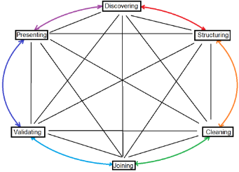

# EDA
The six main practices of EDA are:

- Discovering
- Structuring
- Cleaning
- Joining
- Validating
- Presenting

**Discovering**

Data professionals familiarize themselves with the data, so they can start finding out how to use it, they review the data and ask questions about it like:

Q: What are the column headers? And what do they mean?

Q: How many total data points are there?

Q: How can I break this dataset into smaller groups so I can understand it better?

Q: How can I prove my hypothesis?

Q: In its current form, can the data give me the answers I need?

**Structuring**

The process of taking raw data and organizing or transforming it in a way that is more easily visualized, explored or modelled.

**Cleaning**

Removing errors, missing data, duplicated information or other such outlier points that can distort data or make it less useful.

**Joining**

Augmenting, expanding or adjusting data by adding values from other datasets.

**Validating**

Verifying that data quality is consistent and has a high quality.

**Presenting**

Making your cleaned datasets available to others for analysis or further modelling.

Understand that these processes are both iterative and non-sequential. You might always need to do things over again, add things, validate things, etc …

## Structuring Methods In EDA
- Sorting – Ascending / Descending order
- Extraction – Process of retrieving data from a dataset for further processing

  Ex) Extracting just 2 columns from a large dataset

- Filtering – Selecting a smaller part of the dataset based on some criterion
- Slicing – breaking information down to smaller parts to facilitate analysis from different viewpoints

  Ex) Examining customer behaviour on age range slices

- Grouping – Aggregating different instances of a variable into groups
- Merging – Merging 2 dataframes with the same parameters to enlarge the dataset

## Input Validation
The practice of thoroughly analysing and double-checking to make sure data is error complete, error free, and high-quality

Question to ask when validating data:

- Are all entries in the same format

Ex) Age in numbers (25) not in range (20-30)

- Are all entries in the same range

Ex) Yearly profits normally in millions (7.8M) but one is in thousands (869k)

- Are the applicable data entries expressed in the same datatype and format

Ex) Are all dates datetimes or are all dates in the DD/MM/YYYY format

## What to do with missing values (NaNs)
There are limited things you can do when presented with black spaces or missing values, which, depending on the breadth of your dataset, can range from being a non-problem, to a significant drawback that completely discredits analysis.

The main ways to dealing with missing values are:

- Request for the values to be filled by the data’s owner
  - Best case scenario, especially for if there are large amounts of data missing. This can also mean going through another iteration of data acquisition.
- Delete the missing columns / rows
  - Often the best course in cases with low missing values count, but always make sure those missing values aren’t going to have a major impact and are truly random, as deleting intentionally blank values or values that are blank following a certain pattern can skew analysis.
- Create a NaN category
  - Good strategy if the data itself is categorical, instead of numerical.

    Ex) In  a questionnaire’s results adding a ‘Question not Recorded/Answered’ category.

- Derive new representative values
  - Especially valuable in projects that ask for predicted values and forecasts.
  - Otherwise, there are 4 most common strategies:
    - Forward filling

      Missing values are filled with the same value as the previous.

    - Backward filling

Missing values are filled with the same value as the one after.

- Deriving mean values

Missing values are filled with the same value as the mean.

- Deriving median values

Missing values are filled with the same value as the median.

\*NOTE: Forward and backward filling can still leave missing values in case the one missing is the first or last observation respectively.

## Types of Outliers
- Global Outliers
  - Values that are completely different from the overall data group and have no association with any other outliers.

Ex) Someone’s height being recorded as 7.6 meters.

- Contextual Outliers
  - Normal datapoints under certain conditions, but become anomalies under most other conditions.
  - Most common in time series data.

    Ex) Most movies make the most profit during their first week and then peter out, if it later has a resurgence in popularity that would be an outlier

- Collective Outliers
  - A group of abnormal points that follow similar patterns and are isolated from the rest of the population.
## Dealing with Categorical Data
There are multiple problems that can arise when trying to apply a statistical or machine learning (ML) model or other techniques to Cetegorical Data like occupations, nationality, etc…

There are two categories of categorical data:

**Nominal:** Categorical data that is given the same level of importance.

`	`Ex) Like when ordering class subjects like Physics, Chemistry, English, Arts … 

**Ordinal:** Categorical data that has an ordered, hierarchical structure of importance.

Ex) Like when ordering satisfaction levels Very Satisfied, Satisfied, Neutral, Dissatisfied, Very Dissatisfied

There are two main ways of dealing with this:

- **Dummy Variables / One-Hot encoding**

Using 0s and 1s to indicate the presence/absence of something.

Ex) While categorizing ice cream flavours using 0 to note the absence of a flavour and 1 when they have it.

Ex)

`		`Rest of data	Chocolate	Vanilla		Strawberry

`		`Row 1		1		0		0

`		`Row 2		0		1		0

`		`Row 3		0		1		0

`		`…		…	…

\*NOTE: Whenever you make use of one-hot encoding make sure you aren’t duplicating information (usually done by removing one of the columns) as this can lead to errors when trying to model data.

Ex)  If you only have three ice cream flavours chocolate, vanilla and strawberry, if two of the columns (chocolate & vanilla) are 0 then it must mean that the ice cream’s flavour is the one missing (strawberry).

- **Label Encoding**

Each category is given a unique number instead of using their qualitative value (much like giving each unique category its own primary key).

Ex) All countries in the world are ordered alphabetically and then nationalities are stored as their respective number

\*NOTE: This can also bring in its own unintended relationships when trying to apply the data into a ML model. For example, by assigning something with integers you can inherently create a presumed ranking where the category linked to number one is above all else, etc. There is also the possibility the model derives closer connections between closer numbers since, for example, the distance from 4 to 5 is lower than 4 to 16

Ex) Encoding Male to 0 and Female to 1 can make a model give a preference to Female because 1>0

Consider the following when deciding what kind of encoding to use

Use label encoding when:

- There are a large number of different categorical variables since label encoding uses far less data than one-hot encoding.
- The categorical values are ordinal.
- You plan to use a decision tree or random forest machine learning model (splits data according to categories, doesn’t measure anything).

Use one-hot encoding when: 

- There is a relatively small amount of categorical variables since it uses much more data than label encoding. 
- The categorical variables have no particular order.
- You use a machine learning model in combination with dimensionality reduction (like Principal Component Analysis (PCA)).
# Statistics
## Populations and Samples
Populations is the totality of the group being analysed, or that pertains to the dataset, while a Sample is a smaller group from the Population.

Parameter – A characteristic of a Population

Statistic – A characteristic of a Sample
## Descriptive Statistics
Descriptive statistics describe or summarize the main features of a dataset. There are two main forms of descriptive statistics:

- Visualizations like graphs and tables.

  Ex) Histograms, scatter plots, box plots, …

- Summary stats – summarize data with a single number.

`	`Ex) Mean , median, max, min, std, …

`	`These are two main types of summary stats:

- Measures of central tendency

  Describe the centre of your dataset.

  Ex) Mean, median, mode

- Measures of dispersion

  Describe the spread of your dataset or the amount of variation in your datapoints.

  Ex) Standard deviation, range
### Measures of Central Tendency
Mean: The average value in a dataset.*
` `valuetotal number of values

Median: The middle value of a dataset

Arrange all values from smallest to largest, pick the number in the middle or if the total number of values is even then the average between the two in the middle.

\*NOTE: In the presence of outliers the median is usually a better measure of the center than the average, if there are no outliers use the mean.

Mode: The most frequently occurring value in a dataset.

Calculate which unique entry shows up the most (basically the highest bar of a histogram).

Specially useful when working with categorical data, where you cant use the mean or median.

\*NOTE: There can be datasets with no mode (where nothing repeats), one mode or multiple depending on the data.
### Measures of Dispersion
Range: The difference between the largest and the smallest value in a dataset.

range=max-min

Standard Deviation: How spread out your values are from the mean of the dataset.

sd=(datapoint-mean)2total number of values-1

Variance: The average of the squared difference of each datapoint from the mean.

var=(datapoint-mean)2total number of values-1=sd2
### Measures of Position
Determine the position of a value in relation to other values in a dataset.

The most common measures of position are:

- Percentiles
- Quartiles

They both are basically the same, where they establish a range where datapoints lie upon.

Ex) A test score being in the 99th percentile means that the score obtained is higher than 99% of all the scores obtained by other students.

Quartiles divide a dataset into four equal parts:

Inter Quartile Range: The difference between Q3 and Q1.

IQR=Q3-Q1

Five Number Summary: Summarizes the major divisions in your dataset.

1. Minimum
1. Q1
1. Median or Q2
1. Q3
1. Maximum

Gives you an overall idea of the distribution of your data, from the extreme values to the center, and can be visualized with a boxplot:

There are multiple way of detecting outliers, one of the most common ones being creating a range where if datapoints are 1.5 IQR below Q1 or above Q3 they are considered outliers.
## Inferential Statistics
Inferential statistics make inferences on a dataset based on a sample of the data. In essence, they use information gathered from a smaller sample to infer conclusions about the whole population.

Ex) Predicting the price of a house based on a sample of neighbouring places.

## Probability
There are two main types of probability:

- Objective: Based on statistics, experiments and mathematical measurements
- Subjective: Based on personal feeling, experience or judgement
### Objective Probability
There are two types of objective probability:

**Classical:**

Based on formal reasoning about event with equally likely outcomes.

Calculating a classical probability:

Number of desired outcomesTotal number of possible outcomes

Ex) Rolling a 20 in a 20-sided die has a probability of 1/20 which is 5%

**Empirical:**

Based on experimental or historical data.

Calculating empirical probability:

number of times a specific event occurstotal number of events

Ex) What is the probability of a person preferring cats over dogs? Group 100 people, 34 say they prefer cats -> 34/100 is 34%
### Subjective Probability
This type of probability does not involve formal calculations or a statistical analysis and as such depend on the individuals feelings or experience. As such, it is possible for the subjective probability of a certain event to vary wildly depending on the person.

Ex) You have a feeling that a certain horse is going to win the race.
### Probability Notation
The probability of an event is normally written as:

P(A)

The probability of an event not occurring is:

P(A’)

The probability of two events occurring:

P(A ∩ B)

The probability of an event (B) occurring after another (A) has occurred:

P(B|A)

### Basic Rules of Probability
The different types of events:

- **Mutually Exclusive Events:**

Two events are mutually exclusive if they cannot happen at the same time

- **Independent Events:**

  Two events are independent if the occurrence of one event does not change the probability of the other event.

And the following are the basic rules:

**Complement Rule:**

The complement of a probability is the chance of the event not occurring, and a probability and its complement must add up to 1.

P(A’)=1-P(A)

Ex) The complement of rolling a 5 in a d6 is rolling either 1,2,3,4,6.

**Addition Rule:**

If the events are mutually exclusive, then the probability of either events A or B happening are the sum of their respective probabilities.

P(A or B) = P(A) + P(B)

Ex) With a d6, the probability of rolling an even number OR a 1 is 3/6 + 1/6 = 0.6666…

**Multiplication Rule:**

For two or more independent events the probability of them happening equals the multiplication of their respective probabilities.

P(A ∩ B) = P(A) x P(B)

Ex) The probability of getting heads in a coin flip and a 6 when rolling a d6 back-to-back is 1/2 x1/6 = 1/12.
### Conditional Probability
There is also the case when the outcome of events depend on one another, for this conditional probability is used.

Conditional probability: The probability of an event occurring given that another event has already occurred that changes its probability.

P(A ∩ B) = P(B|A) x P(A)

Ex) The probability of drawing an ace from a deck of cards, having already had drawn another ace from the same deck.

**Bayes’ theorem:**

Allows you to update the probability of an event given new information about it, with prior probability being the probability before new data is collected as posterior probability the probability after.

PBAx PA= PA ∩ B ; P(A|B) x P(B) = P(A ∩ B)

` `PA ∩ B= PA ∩ B↔PABx PB=  PBAx PA↔PAB= PBA\*P(A)P(B)

` `Where P(A) is the prior probability and P(A|B) is the posterior probability.

There is also an expanded version on the theorem relying on the fact that:

PAB+PA'B=1

` `PAB= PBA\*P(A)PBAPA+PBA'P(A')

What version of the theorem should be used depends on what information is available, for example the expanded version does not rely on P(B) only its probability after the occurrence on A or A’.

The expanded version of the theorem is often used in cases of false positives/negatives:

Ex)

A -> Someone has a peanut allergy

B -> The test is positive

P(A) = 0.01 => P(A’) = 0.99

Clinical trials give the following data:

P(B|A) = 0.95 (Probability of True Positive)

P(B|A’) = 0.02 (Probability of False Positive)

Now you have all the information needed to calculate the probability of people having a peanut allergy given that their test came positive.

## Probability Distributions
Describe the likelihood of the possible outcomes of a random event, where a random variable represents the possible outcomes of a random event.

Random variables can be:

**Discrete:**

Has a countable number of possible values

Ex) You can count the number of outcomes like in a die

**Continuous:**

Takes all the possible values in some range of numbers

Ex) You measure the outcome  like when trying to measure someone’s height it can be 1.6843918… m
### Discrete Probability Distributions
- Uniform distribution:

  Models the probability of one event whose outcomes have equal probability (like a die roll).

  Has no equation, is just a horizontal line/same-sized bar chart.

- Bernoulli distribution:

  Models the probability of one event with two possible outcomes, success or failure (like if someone has a sibling or not, yes/no question but the probability isn’t uniform).

  Has no equation, only a two bar bar-chart with the probabilities.

- Binomial distribution:

  Models the probability of events with two possible outcomes, success or failure.

  These events must be independent, and the probability of success be the same for each event.

  PX=k=n!k!n-k!pk(1-p)n-k

  Where

  k – number of successes

  n – number of trials

  p – probability of success in a given trial

  Ex)

  You want to know what the probability of finding 15 people that are ambidextrous in a sample of 100, then your k is 15, n 100 and success would be the person being ambidextrous.

- Poisson distribution:

  Models the probability that a certain number of events will occur during a specific time period (can be changed to occur during a specific space like a distance/area/volume).

  The number of events in the experiment can be counted, the mean number of events that occur during the time period is known and each event is independent.

  PX=k=λke-λk!

  Where:

  λ - mean number of events in the time frame

  k – number of events

  Ex)

  You want to know the probability of a customer service call centre receiving 100 calls, where the average is 50 calls per hour, then λ is 50 and k 100.
### Continuous Probability Distributions
- Normal/Gaussian distribution/z-distribution:

  Continuous distribution that is:

  - Centred on the mean

  - Symmetrical on both sides of the mean 

  - Bell-shaped

  - Total area under the curve equals 1

  **The empirical rule:**

  68% of values fall within 1 standard deviation of the mean, 95% within 2 and 99.7% within 3.

  Typically, datapoints are identified as outliers if they fall beyond 3 standard deviations of the mean.

- t-distribution:

  Has a similar bell shape to a normal distribution but with larger tails, which indicate the higher frequency of outliers that come from a small dataset, as the sample size increases the t-distribution approaches the normal distribution.

`	`
## Z-Scores
Z-scores are a measure of precisely how many standard deviations below or above the populations’ mean a datapoint is:

Zscore= value-meansd

Ex) 

If the mean is 50 and sd 10,  a datapoint with a value of:

50 has a z-score of 0

57\.5 has a z-score of 0.75

17\.5 has a z-score of -3.25
## Sampling
When considering sampling it is imperative that the chosen sample is without bias and representative of the population.

**The Sampling Process:**

1. Identify target population
1. Select sampling frame
1. Chose sampling method
1. Determine sample size
1. Collect sample data

Where the target population is the complete set of elements you’re interested in, the sampling frame is a  list of all the items in your target population (specific details about every item in the population).

Ex) If your target population is all clients above 18 years of age who spend, monthly, an average of 300$ or above in your product, your sampling frame could be a list of names for all those clients, ie Name, Locality, email, etc …

\*NOTE: The sampling frame might not accurately match your target population, since you may not have access to every member of the population, effectively the sampling frame gives you the accessible part of you target population, with as much overlap as possible.

**Sampling Method:**

There are two main types of sampling method, probability sampling and non-probability sampling:

Where:

- Probability sampling:

Uses random selection to generate a sample.

Generally more representative of the whole population and have less bias.

- Non-Probability sampling:

Based on convenience or personal preference.

More convenient and less expensive.

Can be helpful to do exploratory studies where you’re trying to get an initial understanding of the population instead of drawing conclusions from it.
### Probability Sampling Methods
**Simple random sampling:**

Every member of the population has the same chance of being selected.

Due to this they tend to be fairly representative and avoid bias.

But, this mostly applies when using large random samples, which can be very costly. The smaller the sample size the higher the probability of minorities being underrepresented.

Ex) Pull people into a sample by using a random number generator.

**Stratified random sampling:**

Divide 	a population into groups (strata) and randomly select members from each group to be in the sample.

These groups are entirely based on what you want to obtain from a population and can vary from the age range of people to the type of composite material.

Here members of each group are represented.

But, it can be hard to set groupings if you lack knowledge of the population (if the population you’re sampling is made of imperial penguins, if you’re not a biologist, you might not know what is relevant to use as strata).

**Cluster random sampling:**

Divide a population into clusters, randomly select certain clusters and select all members from the chosen cluster for the sample.

Similar to stratified but you select all members of the cluster. Clusters are divided using identifying details (age, sex, eye colour … ).

Ex) A company with offices throughout the world choses to use the information from five random offices in their analysis.

Here every cluster is completely represented in the sample, which can be useful if the cluster accurately represents the population.

**Systematic random sampling:**

Order every member of a population into a sequence, then chose a random starting point and select members for the sample at regular intervals.

Ex) Order the list of students of a university by name, start with the first student whose name starts with J and select every 15th student afterwards.

Has similar advantages to simple random sampling.

It is also quick and convenient when you have a complete list of the members of your population.

But, you need to know the size of your population beforehand to properly select your desired intervals.
### Non-Probability Sampling Methods
**Convenience sampling:**

Chose members of a population that are easy to contact or reach.

Due to the trade-off for convenience this method often shows under coverage bias (under representing some members of a population).

**Voluntary response sampling:**

Members of a population who volunteer to participate in a study.

Suffers from nonresponse bias (certain groups of people are less likely to provide responses).

**Snowball sampling:**

Recruit an initial pool of participants and then ask them to recruit other people to participate in the study.

Also suffers from sampling bias as participants are more likely to recruit people in similar characteristics.

**Purposive sampling:**

Select participants based on the purpose of the study.

Often certain groups are removed to allow the researcher to focus on the group they find most interesting for their study, this group often isn’t representative of the whole population.

Ex) A study on the best learning methods conducted in a school chooses to only consider students with an average grade of A or B
### Central Limit Theorem
The sampling distribution of the mean approaches a normal distribution as the sample size increases, independent of the population distribution

This only applies when the sample data is collected from random selection, and whose values are independent (to insure independence is met sample size should be at most 10% of the population with or without replacement, aka if you’re able to chose one element twice for different samples or not)

Ex)

Imagine that you have a penguin population of 10000 with the following weight distribution:

Where the red line is the mean, lets say 3.5 kg

Now take multiple samples that are large enough from that population, calculate the mean, and plot their distribution:

Basically most samples will have and average weight of 3.25 – 3.75 kg, with some a little bit lower/higher and so on, making the bell curve.

There is no exact rule for how large a sample needs to be in order for the central limit theorem to apply but in general a sample size of 30 or more is considered sufficient.

## Standard Error of the Mean
Each sample of a population will in some way be representative of the population, but it won’t exactly match up all the time.

Ex) if you take multiple samples of 10 penguins from a total population of 10000 it is probable that the average weight statistic of the samples will differ from each other and the overall average weight parameter of the population.

These errors from the population are called the standard error and represent the difference between the sample mean and the actual population mean.

In practical applications scientist won’t be able to use multiple samples, due to constraints like budget, time, … and as such a formula was developed to calculate the standard error of the mean:

standard error of the mean= sdsamplen

Where:

sdsample – sd of the sample

n – sample size

(as can be seen, the higher the size the smaller the standard error)
## Standard Error of the Proportion
A population proportion is the percentage of individuals or elements in a population that share a certain characteristic.

Ex) Finding how many people prefer Nike instead of Addidas.

The central limit theorem also applies to proportion. As such, by obtaining multiple samples from a population and plotting out the distribution of  the proportion, a gaussian curve will be created where the mean proportion of the samples will be an accurate representation of the true proportion of the population.

Calculating the standard error of a proportion:

standard error of proportion= p(1-p)n

Where:

p – population proportion

n – sample size

## Confidence Intervals
Confidence intervals are a way to express a statistic within a range with a respective confidence level (the likelihood that a particular sampling method will produce a confidence interval that includes the population parameter).

Ex)

If the mean population parameter is 85 and you take 100 samples and calculate their interval with a 95% confidence level, then 95 of the confidence intervals of those samples will include the population parameter.

Basically a confidence level will tell you that, for example, 95% of all samples’ confidence interval will include the population parameter.

Common misconceptions are that:

- A 95% confidence level means that 95% of the sample values fall within the confidence interval.
- A 95% confidence level means that 95% of all possible sample means fall within the interval.
- A 95% confidence level means that there’s a 95% probability of the population parameter being within the interval.

A confidence interval is created through the following steps:

1. Identify a sample statistic
1. Chose a confidence level
1. Find the margin of error
1. Calculate the interval

Where the interval is given by:

interval=sample statistic ±margin of error

And the margin of error is the maximum expected difference between a population parameter and a sample estimate:

margin of error=zscoreconfidence level ×standard error

Where the zscores are dependent on the confidence level chosen, for example:

|Confidence level|Z-score of confidence level|
| :-: | :-: |
|90%|1\.645|
|95%|1\.96|
|99%|2\.58|

\*NOTE: Remember that the larger your sample size the narrower the confidence interval will be, as it more accurately represents the population and in opposition the higher the confidence level the wider the confidence interval will be.
## Hypothesis Testing
Hypothesis testing is a statistical procedure that uses sample data to evaluate an assumption about a population parameter or if it is statistically significant (which is the claim where the results of an experiment or test cannot be explained by random chance alone).

Steps for performing hypothesis tests:

1. State the null hypothesis and the alternative hypothesis
1. Choose a significance level
1. Find the p-value
1. Reject or fail to reject the null hypothesis

Where:

The null hypothesis is the claim assumed to be true, unless there is convincing evidence on the contrary (typically considers that the observed data occurs by chance).

The alternative hypothesis is a hypothesis that contradicts the null hypothesis and is accepted as true only if there is convincing evidence of it (typically considers that the observed data does NOT occur by chance).

The significance level is the result at which you’ll consider results statistically significant. It is also the probability of rejecting the null hypothesis when it is true.

Ex) You’re doing a hypothesis test and set your significance level to 5%, unbeknown to you and by pure chance, an event with a probability of 1.53% of happening occurs. This proves the alternative hypothesis, when in fact it wasn’t correct.

\*NOTE: Usually significance level is set at 5%, other common choices are 1% and 10%.

The p-value is the probability of observing results as or more extreme than those observed when the null hypothesis is true (a lower p-value translates into stronger evidence for the alternative hypothesis).

To reject or fail to reject a hypothesis you compare the p-value to the significance level:

- P-value > significance level: Fail to reject the null hypothesis
- P-value < significance level: Reject the null hypothesis

\*NOTE: Statisticians use the terminology of rejecting or failing to reject, due to hypothesis test being based on probability, while acceptance implies certainty
### Hypothesis Testing Errors
Hypothesis testing, due to being based on probability are vulnerable to two main types of errors:

- **Type I Error: False positive**

  Rejecting a null hypothesis that is actually true (concluding that a result is statistically significant when it in fact occurred by chance).

  To lower the chances of committing a type I error, chose a lower significance level.

  Leads to the implementation of changes that are unnecessary or ineffective (Ex: an ineffective medicine is considered effective).

- **Type II Error: False Negative**

  Failing to reject a null negative when it is actually false (concluding that the result occurred by chance when it didn’t).

  Leads to missed opportunities for positive change (Ex: a new effective medicine is considered ineffective).

It is your responsibility to decide the threshold considered as statistically significant depending on the situation being studied. Higher significance levels might be acceptable in some situations but, for example, when testing the probability of a parachute rupturing 1% or possibly lower values should be considered.
### One-Sample Test
Determine whether a population parameter like a mean or proportion is equal to a specific value (null hypothesis).

There are three main options for the alternative hypothesis, it is not equal to, it is greater than or it is less than a specific/observed value.

Ex) Testing to see if a medical treatment’s average success rate is equal to a certain goal

**Z-tests:**

Allow you to obtain the p-value of the hypothesis test through z-scores:

Ex)

The average delivery time for Pizza Hut is 15 minutes, a sample was taken from a store where the average delivery time was 13 minutes.

The null hypothesis states that this is random chance while the alternative hypothesis states that their average delivery time is smaller than the 15 minutes.

As such, assuming the null hypothesis is true, you need to find the probability by random chance for the delivery time to be 13 minutes.

Assumptions needed:

- Data is a random sample of a normally distributed population
- The standard deviation of a population is known

Formula to calculate the test statistic z-score :

Zscore= meansample-meanpopulationsdpopulationsizesample

After calculating the z-score the p-value will be the area delimited by it (either left or right depending on the test you’re doing if the alternative hypothesis is either lesser or greater, or both if it is not equal to).
### Two-Sample Test
Determines whether two population parameters such as two proportions or two means are equal to each other.

**Two-sample T-tests:**

Standard approach in data analytics for comparing two means (cannot be applied to proportions).

Assumptions:

- The two samples are independent from each other.
- For each sample the data is drawn randomly from a normally distributed population.
- The population’s standard deviation is unknown and needs to be estimated from the data.

Null hypothesis: There is no difference in the two sample’s means.

Alternative hypothesis: There is a difference between the two means.

In this case the p-value is the probability of observing in your sample means as or more extreme than the difference observed if the null hypothesis is true.

Formula to calculate the test statistic t-score:

Tscore= meansample1-meansample2sdsample12sizesample1+sdsample22sizesample2

Since the alternative hypothesis is it being different, you’re interested in both tails instead of just one.

**Two-sample Z-tests for proportions:**

Commonly used for comparing proportions between samples.

Ex) Comparing the level of employee satisfaction between two offices.

Null hypothesis: There is no difference between the proportions of the two groups.

Alternative hypothesis: There is a difference between the proportions.

Zscore= psample1-psample2ppool(1-ppool)(1sizesample1+1sizesample1)

Where:

P – proportion

Ppool – weighted average of the two proportions
### Chi-Squared Goodness of Fit Test
For categorical variables, determine whether an observed categorical variable follows an expected distribution.

This can be visualized by, for example, creating a bar graph with both the observed and expected values for each category side by side.

Null hypothesis: The variable follows the expected distribution.

`	`Ex) Normal cereal sells 30 units, extra fibre 20 units and extra protein 15 units.

Alternative hypothesis: Variable doesn’t follow the expected distribution.

Χ2=(Observed-Expected)2Expected

With the value of chi-squared you utilize chi-squared curves (which are based on the degree of freedom available to the system).

DoF=numbercategorical levels-1

Ex)

A categorical variable can be Very dissatisfied, Dissatisfied, Neutral, Satisfied and Very Satisfied. The degree of freedom of the system is 5-1=4.

The p-values can be obtained by calculating the area to the right of your chi-squared value.

### Chi-Squared Test for Independence
For categorical variables, determine whether or not two variables are associated with one another.

First establish your variables.

Ex) If weather (raining/not raining) and restaurant customer satisfaction (satisfied/dissatisfied) are associated.

Null hypothesis: The variables are independent and not associated.

Alternative hypothesis: The variables are no independent.

To visualize this you utilize a matrix:

Ex)

||Rain|No Rain|Total|
| :-: | :-: | :-: | :-: |
|Satisfied|15|20|35|
|Not Satisfied|17|5|22|
|Total|32|25|57|

EIJ=RICJT

Where:

EIJ - the expected value of row I, column J

RI - the total of row I

CJ - the total of column J

Then you use the same formula to calculate chi-squared:

Χ2=(Observed-Expected)2Expected

You can then use the chi-squared curves for the related degree of freedom to find the p-values.

\*NOTE: To calculate the degrees of freedom when more than one variable if involved you calculate them for each variable and then you multiply them.

DoF=(numbercategorical levels-1)A×(numbercategorical levels-1)B×(…)
# Regression Analysis
Regression analysis is a group of statistical techniques that use existing data to estimate the relationships between a single dependent variable and one or more independent ones.

Where the dependent variable is the variable that a model estimates (y=f(x)), also called a response or outcome variable.

And the independent variables are the variables that explain trends in the independent variables, also called an exploratory or predictor variable.

When observing relationships between variables there are two possibilities at a given instance:

- Positive correlation

  Where two variables tend to increase together.

- Negative correlation

  Where one increases and the other decreases.

\*NOTE: Do not confuse correlation with causation, correlation only implies some kind of relationship, not specifically a cause-and-effect relationship (which requires much more rigorous methods).
## Linear Regression
Estimates the linear relationship between a continuous dependent variable (dependent/predicted variable) and one or more independent variables (independent/predictor variables).

Y=b+mX    OR is statistic speak   μYX= β0+β1X

\*NOTE: μ and the regression coefficients βi are both representative of population parameters, to represent their estimates use:

μYX= β0+β1X    OR    Y=β0+β1X 

When calculating a linear regression the objective is minimizing the loss function that measures the distance between the observed values and the model’s estimated values (residual).

residualdetapoint=ε=observed-predicted

You then use the Sum of Squared Residuals (SSR) to group those residuals together:

εi2

And use that to calculate the linear regression coefficients, where the most common method is the Ordinary Least Squares Estimation (OLS).
### Assumptions of linear regression
- **Linearity:** Each predictor variable is linearly related to the outcome variable.

  \*NOTE: If you don’t have any continuous independent variables linearity is not required.

- **Normality:** The residuals or errors are normally distributed.

  You can only check when the model is built with, for example, a Q-Q plot of the residuals and see if they are linear.

- **Independent observation:** Each observation in the dataset is independent.
- **Homoscedasticity:** The variation of the residuals is constant or similar across the model.

  You can only check after by plotting the residuals if favour of the fitted values and seeing if their distribution remains similar and there aren’t specific trends.
### Uncertainty in Linear Regression
Since a regression’s objective is to estimate a population’s parameter it is also key to identify the uncertainty that pertains to the values obtained.

As such, it is common to have access to a confidence interval (usually 95%), that gives a confidence interval where there is an X% chance of the interval including the true value of the slope.

Which creates a confidence band such as the one below:

Beyond this it is useful to understand that in a regression analysis, each beta coefficient goes through the following hypothesis testing:

- Null hypothesis: beta coefficient is 0
- Alternative hypothesis: beta coefficient is different than 0

As such, you also have access to the p-values pertaining to the regression coefficients. Which allow you to determine whether the correlations found are statistically significant (Ex: p-value below 5% being statistically significant).
### Evaluation Methods in Linear Regression
To understand how well the regression fits the data there is the statistic **r** (Pearson’s correlation coefficient), which varies from 0 to 1, either positive or negative depending on the correlation, where the closer you are to 1 the closer your actual data is to your model.

r=covariance(X,Y)sdX×sdY ;

covarianceX,Y= (xi-x)(yi-y)n-1

The most commonly used evaluation method to ascertain a model are:

- <b>Coefficient of determination (R2)</b>

  Which measures the proportion of variation in the dependent variable explainable by the independent variable.

  R2=1-SSRSST=1-SSR(yi-y)2

  Ex) When doing a regression analysis on the energy generated by solar panels dependent on daily luminosity you get to an R2 of 0.874, which means that luminosity explains about 87.4% of the variance in energy generation and there are still other 13% that aren’t explained by the model (such as cloud frequency, etc … ).

- **Mean Squared Error (MSE)**

  Average of the squared residuals.

  MSE=SSRnsample-nbeta coefficients
**
`	`Very sensitive to large errors.

- **Mean Absolute Error (MAE)**

  Average of the absolute of the residuals.

  MAE=absεnsample-nbeta coefficients

  Not sensitive to large errors, used if there are outliers you want to ignore.

- **Hold-Out Samples**

  A sample of data that isn’t used in the creation of the model and is then later on used to see how well it fits the sample.
## Multiple Linear Regression
Allows the use of more than one independent variable:

Y=β0+β1X1+β2X2+…+βnXn
### Assumptions of Multiple Linear Regression
Multiple linear regression has the same as with singular linear regression, plus the following one:

**No multicollinearity:** No two independent variables (like X1 and X2) can be highly correlated with each other (they cannot be linearly correlated).

Ex) Make a scatter plot matrix of the variables and access linearity between the independent variables.

You can also calculate the Variance Inflation Factors (VIF) which quantify how correlated each independent variable is with all of the other independent variables, where the smallest value is 1 and the larger the number the higher the multicollinearity.

\*NOTE: A number of 5 or above is enough to indicate the presence of multicollinearity.

To handle independent variables with multicollinearity you either:

- Drop one or more of the variables that have high multicollinearity.
- Create new variables using existing data.
### Variable Selection Methods
The two most basic techniques for independent variable selection are the following:

**Forward Selection:**

Iterative process that begins with the null model with no independent variables:

Y=β0

Then it considers all the independent variables available and selects the one that contributes the most to a higher explanatory power (variable that increases R2 the most):

Y=β0+β1X1

Repeat the last step until your threshold is reached.

**Backwards Elimination:**

Iterative process that begins with the full model with all of the independent variables:

Y=β0+β1X1+β2X2+…+βnXn

Then it removes the variable that adds the least to the explanatory power (variable that increases R2 the least):

Y=β0+β1X1+β2X2+…+βn-1Xn-1

Repeat the last step until your cut-off point is reached.

To determine where that threshold/cut-off point is one common test is the extra-sum-of-squares F-test which quantifies the difference between the amount of variance left unexplained by a reduced model vs the full model.
### Interaction Between Independent Variables
In some scenarios you’ll find that although not linear independent variables can have an effect on one another.

Ex) In a coffee shop you study sales as a variable dependent on coffee temperature and the daily temperature, there is a high likelihood that lower daily temperatures changes the perception of coffee temperature (ie people might usually prefer their coffee slightly hotter on rainy/cold days).

To account for this you might include an interaction term that represents how the relationship between two independent variables effects changes in the mean of the dependent variable:

Y=β0+βAXA+βBXB+βinteraction×(A×B)
### Overfitting
The more independent variables you add to a multiple linear regression the higher the R2 will be, but this in turn can lead to a problem of overfitting, where a model fits the observed or training data too specifically, and is unable to generate suitable estimates for the general population.

In essence, you’re preforming a regression to estimate population parameters, but by overfitting the model no longer represents the population and only represents the sample you’re using.

This is one of the reasons it is crucial to evaluate model performance through hold-out sampling etc…
### Evaluation Methods for Overfitting (Adjusted R2)
The adjusted R2 is an adjusted version of the coefficient of determination that penalizes unnecessary independent variables.
### Regularization
There is a constant balance between bias and variance when constructing a model, too high of a bias simplifies the predictions and relationships, underfitting the data and creating inaccurate estimates, while too high variance adds complexity and can overfit the data, getting inaccurate results for data outside of the one used to train the model.

\*NOTE: Variance in this context does not relate to the variance of a distribution (sd2).

For this regularization is a set of techniques that lower regression coefficient estimates towards zero, adding in bias to reduce variance.

There are three common regularization techniques:

- Lasso regression

  Completely removes variables that are not important to predicting the dependent variable.

- Ridge Regression:

Impact of less relevant variables is minimized but none are removed.

- Elastic-Net Regression:

Tests the benefit of Lasso, Ridge or a hybrid of the two.

## Linear Regression with Independent Categorical Data
Categorical data to be used in regression must go through either one-hot or label encoding.

Y=β0+(…)+βcategoryAXcategoryA+(…)

Where for example in category A X=1 if a post is launched on Instagram vs X=0 if it is posted on TikTok.

As such the beta coefficient of a category represents the total impact of that category in the dependent variable.

Ex)

If you’re studying the body mass of penguins and your category is X=1 male, X=0 female, then if the beta coefficient is 523g then on average male penguins will weigh 523g more, because:

if male: Y= beta0 + beta1\*penguin\_height + 523\*1

if female: Y= beta0 + beta1\* penguin \_height + ~~523\*0~~

Categorical variables with more than two possibilities will need n-1 number of regression coefficients.

Ex)

In a category with the following options: Negative, Neutral, Positive

You only need:

Y=(…)+βpositiveXpositive+βnegativeXnegative

Because if 

Xpositive = 1 and Xnegative = 0 then it is also not Neutral

Xpositive = 0 and Xnegative = 1 then it is also not Neutral

Xpositive = 0 and Xnegative = 0 then it is Neutral
## Analysis of Variance (ANOVA)
ANOVA is a group of statistical techniques that test the difference of means between three or more groups, similar to t-tests but for more groups.
### ANOVA Assumptions
ANOVA relies on the following assumptions:

- **Normally distributed**

Within each group, the dependent variable is normally distributed.

\*NOTE: Usually ANOVA can handle the breaking of normality, particularly when group sizes are large and similar to one another due to the central limit theorem.

- **Independent observations**
- **Homoscedasticity**

  The variance around each groups’ means is constant or similar across the model.
### One-way ANOVA
Compares the mean of one continuous dependent variable based on three or more groups of a singular categorical variable.

Ex) Penguins being studied can belong to 3 different species A, B or C, and you want to see how their average height compares to one another.

Visualize this as a table like the following:

||Species A height|Species B height|Species C height|
| :-: | :-: | :-: | :-: |
|1|X1|Y1|Z1|
|2|X2|Y2|Z2|
|3|X3|Y2|Z3|
|(…)|(…)|(…)|(…)|

Null hypothesis: The three or more groups’ means are all equal.

Alternative hypothesis: The three or more groups’ means are not all equal.

You first calculate the mean of each group and the overall mean:

`	`Ex) Height\_A = … , Height\_B = … , Height\_C = … , Height\_Overall = … ,

Then calculate the sum of squares between groups (SSB):

SSB= sizegroup×(meangroup-meanoverall)2

Then calculate the sum of squares within groups (SSW):

SSW= group=1i(observed valuegroup,i-meangroup)2

Then calculate the mean squares between groups (MSSB) and mean squares within groups (MSSW):

MSSB=SSBk-1

MSSW=SSWn-k

Where:

k – number of groups

n – total size of the data

Finally calculate the F-statistic:

Fstatistic= MSSBMSSW

And use the F-distribution graphs (dependent on the DoF of the system) to get the p-values (area to the right of the F-statistic).
### Two-way ANOVA
Compares the mean of one continuous dependent variable based on three or more groups of two different categorical variables.

Ex) Studying the height of penguins where they’re categorized by species (A, B or C) and also by life-stage (Cub, Adolescent, Adult).

This creates a matrix of hypothesis:

||Null Hypothesis|Alternative Hypothesis|
| :-: | :-: | :-: |
|Species|µA = µB = µC|NOT µA = µB = µC|
|Life-Stage|µCub= µAdolescent = µAdult|NOT µCub= µAdolescent = µAdult|
|Species – Life-Stage Interaction|Effect of Species on height and Life-Stage on height are independent|There is an interaction between species and life-stage on height|

### ANOVA Post Hoc Test
Does a pairwise comparison between all the groups while controlling for the error rate.

Ex) In a one way test where the groups are A, B, C, D the post hoc test will pair them together and analyse them A-B , A-C , A-D, B-C, B-D, C\_D

Common pot hoc test: Tukey’s Honest Significant Difference (HSD) test
## Analysis of Covariance (ANCOVA)
Statistical technique that tests the difference of means between three or more groups while controlling for the effects of covariates (variables irrelevant to your test).

This is similar to multiple linear regression in that it considers multiple independent variables, but you’re only interested in your main one.

Ex) When studying the sales of a product depending on survey satisfaction levels you also take into consideration the user’s age.

Null hypothesis: The mean is equal for all groups, regardless of the covariates.

`	`Ex) Product sales are equal for all satisfaction levels regardless of user age.

Alternative hypothesis: The mean is not equal for all groups, regardless of the covariates.
## Multivariate Analysis of Variance (MANOVA)
Extension of ANOVA that compares how two or more continuous outcome variables vary according to categorical independent variables.

In essence, it’s an extension of ANOVA to include more than one dependent variable.

Such as ANOVA, the two most common versions are:

- One-way MANOVA: One categorical variable.
- Two-way MANOVA: Two categorical variables.

Null hypothesis: The means of the dependent variable A and of the dependent variable B are equal for each group .

Alternative hypothesis: The means of the dependent variable A and of the dependent variable B are not equal for each group.
## Multivariate Analysis of Covariance (MANCOVA)
Extension of ANCOVA to include more than one dependent variable.

Null hypothesis: The means of the dependent variables are equal for each group, regardless of the covariate.

Alternative hypothesis: The means of the dependent variables are not equal for each group, regardless of the covariate.

## Logistic Regression
A technique that models a categorical dependent variable based on one or more independent variables where the objective is modelling the probability of an outcome.

Ex) Establishing a relationship between whether a user subscribes to a newsletter or not depending on the time spent on a website, the dependent value is categorical (either a Yes or a No), so you can’t draw a best fit line and a new kind of representation is needed.

Where the probability of something occurring, given the effect of the independent variables is:

μYX= Probability Y=1X=p

To express the relationship between dependent or independent variables you need a link function:

gp=β0+β1X

### Maximum Likelihood Estimation (MLE)
Technique for estimating beta parameters that maximize the likelihood of the model producing the observed data, where likelihood can be translated to obtaining the observed data when utilizing a set of beta parameters.
### Binomial Logistic Regression
Models the probability of an observation falling into one of two groups in a category, dependent on one or more independent variables.

In essence, here your dependent variable is categorical with only two possibilities (yes/no), (male/female), (0/1), …

In this method you’re interested in what is the probability of Y=1 (since we’re dealing with binomial data) as such you use the Logit to act as the linking function.

Where the logit or log of odds of a given probability is the following:

Logit=ln(Odds)=ln(p1-p)

As such you create the link function:

gp=lnOdds=ln⁡(p1-p)=β0+β1X1+β2X2+…+βnXn

Where the beta coefficients will show that a singular increase in a variable will have an eβi effect on the odds of Y=1.
### Binomial Logistic Regression Assumptions
- **Linearity:**

  There should exist linearity between each independent variable and the logit of the probability that Y=1.

- **Independent Observation:**

  Depends on how the data was obtained.

  If true we can assume that P(A∩B) = P(A) \* P(B)

- **No Multicolinearity:**

Just like with multiple linear regression

- **No Extreme Outliers:** 
## Evaluating a Classification model
One of the best methods to evaluate such a method is through a confusion matrix, which represents all in one:

- True Positives
- False Positives
- True Negatives
- False Negatives

With these three variables you’re able to calculate the following:

**Precision**

Percentage of positive predictions that were true positives:

Precision= True PositivesTrue Positives+False Positives

**Recall**

Percentage of positives identified correctly:

Recall= True PositivesTrue Positives+False Negatives

**Accuracy**

Percentage of points correctly categorized:

Accuracy= True Positives+True NegativesTotal Points

**F1 score**

Accuracy= 2×Precision×RecallPrecision+Recall

There are also other methods of evaluation:

**Receiver Operating Characteristic (ROC) Curves:**

Allows you to visualize the performance of the model at different classification thresholds by plotting:

X: True positive rate, same as recall.

Y: False Positive Rate – False Positive/(False Positive + True Negative).

**Area Under ROC Curve (AUC):**

` `AUC ranges from 0 to 1, with 0 being predictions are 100% wrong, and 1, 100% correct.

An AUC below 0.5, means that the model performs worse than a random classifier.

# Machine Learning
The use and development of algorithms and statistical models to teach computers to analyse and discover patterns in data, without being explicitly programmed in how to do so.
## Machine Learning Model Types
**Supervised learning:**

Type of model most often used in work applications.

Uses labelled datasets to train algorithms to classify or predict outcomes, where label data is data that has been tagged with a label that represents a specific metric/property.

Ex) You’re making a ML model that predicts whether a beverage is in a can or bottle based on height. On a supervised model you’ll have a whole dataset with heights of beverages and their specific label (can/bottle).

Main functions:

- Classify: Separating incoming data into their respective groups.
- Predict: Estimates future data.

**Unsupervised Learning:**

Analyses and groups unlabelled datasets.

More open ended, where you’re asking the model to obtain information without telling it what the answer should be.

Ex) Looking back at the previous example, on a unsupervised model, you’d only have access to the list of heights and the model would have to make its own assumptions of what the correct answer would be.

**Reinforcement Learning:**

The model starts of with a policy or set of rules it has learned and implements it.

Then, the model is set up to reward or punish a computer’s behaviours depending if the action results in a favourable/unfavourable outcome.

Through this, it updates its policy, creating an iterative process to maximize rewards/ minimize punishment.

**Deep Learning:**

Made up of layers of interconnected nodes, working similarly to a brain, where each layer of nodes receives signals from the nodes in its preceding layer, which then pass transform signals either to a final layer of an output.
## Machine Learning Model Based on Features (variables)
It is extremely important that you’re aware of the kind of feature you’re inputting into a ML model to know what kind to use:

- Continuous features – Are infinite/ have an uncountable number of values.
- Categorical features – Have a finite number of groups (can be grouped).
- Discrete feature – Have a countable number of values (can be counted).
## Recommendation ML Systems
Unsupervised learning techniques using unlabelled data to offer recommendations.

To do this they have as a goal to quantify how similar two things are from one another, so they’re able to use that information to suggest other closely related options.

**Content Based Filtering:**

The comparison is made based on attributes of the content.

Ex) A song is of X genre, has X instruments, X bdm, belongs to X album, is in X key, etc…

Pros:

- Easy to understand.
- Recommends what the user like.
- Doesn’t need information on other users.

Cons:

- Only recommends more of the same.
- Requires the specific data on the attributes (usually manual inputs).
- Can’t make recommendations across content type.

  Ex) A song and an Audiobook have completely different attributes and as such a content-based filtering system for songs can’t be used to suggest audiobooks.

**Collaborative Filtering:**

The comparison is based on who else liked the content and if they have similar preferences.

Ex) If a lot of other people with similar Netflix profiles to yours have all interacted and liked the series The Office, there’s a high likelihood for it to recommend you that series.

Pros:

Since the model is only interested on how other users interact with the content:

- No data is required of the content itself.
- Can find hidden correlations in the data.
- Can make recommendations across content type.

Cons:

- Requires a lot of data to get useful results.
- Requires a lot of data from each user.
- Data can be very sparce for less popular options, leading to many missing values.

It is important to note that most recommendation systems are fallible to popularity bias, where only the content with higher interaction is dissipated, despite there being content of similar quality or even better.
## Model Fairness and Ethics
Many of the biases that crop up in ML models aren’t the result of direct oversight, and can easily come from slight biases that are propagated throughout the process.

Ex) In a facial recognition model the sample that you got to test might be more distributed towards a certain gender/ age group/ ethnicity etc… these biases in data collection can led to underperformance with a worldwide net of users.

To prevent this always keep in mind, throughout the modelling process:

- What is the purpose of the model?
  - How will the model be used.
  - By whom will it be used.
  - Who is affected by the model.
  - How harmful/significant can effects/errors be.

ML is often used to make predictions of merit, from who is allowed certain scholarships to what candidates should go to the next hiring stage. What are the consequences of the model being incorrect? What are the long term consequences?

- Are there any issues with the data?
  - Is it appropriate, well sourced, representative?
  - Do you have consent to use it?
- Is it important to explain where predictions come from?

  Some models, called black-box models, like deep learning and neural networks are extremely difficult to explain and as such aren’t suitable to situations where transparency in paramount.

- Does the model and/or predictions make sense?
- Are the predictions fair?

  One way to evaluate fairness is by analysing the how the model’s error is distributed over the population and if it only makes errors in particular cases that are similar.

- Is anyone responsible for monitoring the model (pre/post deployment)?

Making sure it keeps working well and look for potential harm.

To reiterate, ALWAYS keep in mind the issue of consent throughout the process.
## Feature Engineering
Process of using practical statistical, and data science knowledge to select, transform or extract characteristics, properties and attributes from raw data.

The three general categories of feature engineering are:

- Selection

  Select the features that contribute the most to predicting your response variable.

- Transformation

  Modifying existing features in a way that improves accuracy when training the model.

  Ex) Your data might have the length of fish, but you might only need to know if it was small, medium or large, so you establish those cut-off points and transform the feature.

  Ex2) Utilizing the log of a variable.

  Ex3) Normalizing a variable so it doesn’t have too much influence over a model compared to other similarly important features.

- Extraction

Utilizing multiple features to create a new one that improves the algorithm.
### Transformation
Examples of common transformations performed are:

- Log normalization - Utilizing the log of a variable

  Some models can’t handle skewed distributions very well, to reduce the skew you use the log.

- Scaling – Adjust the range of a features values by normalizing them.
  - Normalization (uses the data’s range)

    xi,normalized=xi-xminxmax-xmin

    Features with a higher scale of magnitude can be more influential in some models.

  - Standardization

    xi,standardized=xi-xmeanxsd

    Transforms a feature so it has a mean of 0 and sd of 1, which is useful for some algorithms.

- Encoding – Converting categorical data into numerical.
  - One-Hot
  - Label/Ordinal
## Issues In ML Data Source
Multiple issues can arise due to the data available to train the model.
### Class Imbalance
When a dataset has a predictor variable that has more instances of one outcome than another.

Ex) Very common in spam detection, where there might be only a handful of spam messages vs the millions of normal  messaging.

A distinction is made where the largest class is called the majority class and the other the minority class.

\*NOTE: Issues mainly only arise when this discrepancy is extreme with the majority taking 99% or more.

To combat this there mainly exists two techniques to bring the proportions closer together:

- Up-sampling – Artificially increases the minority class.
  - The most common way to do this is called Random Over-sampling where random datapoints of the minority class are duplicated and added back to the dataset.
  - It is also possible to use mathematical techniques to generate non-identical data.
- Down-sampling – Decreases the majority class.

\*NOTE: The objective of this technique isn’t exactly to bring the classes to a 50/50 split, and that proportion can have an effect on model performance .

General rules of when to Up/Down sample:

**Down-sampling** – Usually more effective when working with extremely large datasets.

**Up-sampling** – More effective with smaller datasets.

\*NOTE: Class imbalance is always a finnicky process and you will only truly know what is the best answer when evaluating the performance of the built model.

It is also possible that by treating the class imbalance you develop a model that over-predicts the minority class and should mostly be done when other alternatives have already failed to provide satisfactory results.
## Classification Models
### Supervised - Naïve Bayes
Supervised classification technique based on Bayes’s theorem  with an assumption of independence among predictors.

It is one of the simplest classification algorithms used today, where the posterior probability can be calculated through:

PcX=PX1c× PX2c×… ×PXnc×Pc÷P(X)

Then for each feature construct frequency and likelihood tables :

Ex)

|
Feature A

(Weather vs

Playing soccer)
|Yes|No||Yes|No||
| :-: | :-: | :-: | :-: | :-: | :-: | :-: |
|Sunny|3|2||3/9|2/5|5/14|
|Overcast|4|0|->|4/9|0/5|4/14|
|Rainy|2|3||2/9|3/5|5/14|
|||||9/14|5/14||

Where P(Yes|Sunny) = P(Sunny|Yes) \* P(Yes) / P(Sunny) = (3/9) \* (9/14) / (5/14)

Pros:

- Calculations needed to make are very cheap resource wise.
- Highly scalable.

Cons:

- Assumption of conditionally independent features, rare among real world scenarios.

  \*NOTE: The model can still perform satisfactorily even if the assumption is broken.

- Zero frequency problem. If one of the predictors doesn’t have occurrences then its probability is 0 and since the final posterior probability is a multiplication of those factors it would also immediately be 0.

  \*NOTE: To stop this a negligible value (usually 1) is added to each variable frequency.
### Supervised – Tree-Based Learning
Type of supervised machine learning that preforms classification and regression.

Makes use of a decision tree, flow-chart like classification model that represents the multiple solutions to a given problem, depending on the outcome of related attributes/choices.

Decision trees are made up of nodes and edges, where edges connect nodes together along the chain, while nodes are where decisions are made and a feature of the data is decided on, taking different edges depending on the outcome.

The first node is called the root node and is where the first decision is made, while all other nodes are called decision nodes except the last ones that make a final prediction and are called leaf nodes.

Nodes that connect further in the chain are called parent nodes, and nodes that are connected to from backwards in the chain are their child nodes.

The order of what and where variables are assessed in a node are made based on the class impurity (degree of mixture in regards to class) of their respective children.

A set of potential split points is generated for each predictor variable and an algorithm is used to predict the purity of the child nodes from each split point. The split that generates the purest child nodes is then selected for the model.

\*NOTE: The split points will depend on what the type of the predictor variable is. If it is categorical the algorithm will try to split based on category, if it is continuous often split points chosen are percentiles of the distribution.

The most straightforward way of calculating the impurity of a child node is:

Gini impurity= 1-i=1NP(i)2

Where:

i – class

P(i) – probability of samples belonging to class I in a given node

\*NOTE: Gini impurity can range from 0 to 0.5, where 0 means there is no impurity and the node is a leaf node and 0.5 that classes are equally represented

Then you calculate the weighted average of the Gini impurity of both child nodes:

nsamples1nsamplesTotal×impurity1+nsamples2nsamplesTotal×impurity2

Pros:

- Doesn’t require any assumptions regarding the distribution of the data.
- Are able to handle collinearity.
- Often requires little to no data preprocessing:
  - Works easily with all types of variables.
  - Doesn’t require normalization or scaling.

\*NOTE: Although the decision tree model can work will all types of variables they still need to be converted into numeric.

- Decisions made are clear and easy to understand.
- Able to handles outliers.

  Since it decides by splitting data in a range it doesn’t matter how far you are from the split, only if you are on one side or the other of it.

Cons:

- Can be particularly susceptible to overfitting.
- Can be very computationally straining when compared with other models.

\*NOTE: Decision Tree models are often chained in parallel to reduce bias and variance, those are called random forests, more information in the Ensemble learning section.
### Tree-Based Hyperparameter Tuning
Hyperparameters, parameters that can be set before the model is trained.

There are multiple hyperparameters that can be used to further improve your model’s performance.

- Max Depth: Max number of node layers that the decision tree can have.

  Can help reduce overfitting by limiting how deep a tree grows.

  Eases computational requirements.

  \*NOTE: The root node is level 0, so if a decision tree has three total layers it has a depth of 2.

- Min samples leaf: Minimum samples allowed in leaf nodes.
- Min samples split: Minimum number of samples needed for a node to split.

It is the possible to utilize Grid Search to find the optimal values for the parameters, by checking each set of hyperparameters to select the one who creates the best results according to a certain metric.

<table><tr><th colspan="2" rowspan="2">Ex)</th><th colspan="3">Max Depth</th></tr>
<tr><td>4</td><td>6</td><td>None</td></tr>
<tr><td rowspan="4">
Min

Samples

Leaf
</td><td>1</td><td></td><td></td><td></td></tr>
<tr><td>5</td><td></td><td></td><td></td></tr>
<tr><td>10</td><td></td><td></td><td></td></tr>
<tr><td>25</td><td></td><td></td><td></td></tr>
</table>

In essence, you create an n-dimensional grid with all the hyperparameters you want to test, a tree is grown for each case and all the models are evaluated to see who performs best.

\*NOTE: Grid searches can become very computationally expensive when dealing with larger number of values for a hyperparameter or too many hyperparameters. There are two main ways to go about this, either select fewer values but with wider ranges and then iteratively try to hone in on the optimal solution, or select a more fleshed out number of values and let the model search for a potentially very long time.
## Clustering/Partitioning Models
### Unsupervised – K-Means
Unsupervised partitioning algorithm used to partition data into groups/clusters.

Where each cluster is defined by its central point the centroid (mean of all points in that cluster).

\*NOTE: In almost all cases, it is important to scale the data before you model it since K-Means doesn’t know the units and only cares about distances.

\*NOTE: K-Means is a partitioning algorithm instead of a clustering algorithm because it does not allow un-assigned outliers.

**Step 1:**

Chose the number of centroids (k) and randomly place them in the data space:

\*NOTE: k is a value that you decide on, sometimes you’ll have an idea of how many centroids you’ll need (like if you have 5 products that you need to analyse) but if you don’t do an iterative process and figure out what number performs the best.

**Step 2:**

Assign all data points to their nearest centroid based on their distance to the points, creating the clusters:

**Step 3:**

Recalculate the centroid of each cluster by calculating their mean point:

**Step 4+:**

Repeat steps 2 and 3 until model convergence is found (centroid positions are stable).

\*NOTE: It is important to experiment with multiple starting locations to make sure that local minimums do not stop the convergence process.

Ex)

\*NOTE: Most machine learning packages have taken into consideration the problem with local minimums and therefore first create their centroids in a different manner (one centroid is chosen from one of the datapoints and then selects other datapoints that are far away to be the remaining centroids). As an example, in scikit-learn this function is k-means++.
### Finding Optimal K-Means and Evaluating Models
Determining a K-Means model’s effectiveness is a little bit more complicated from other models such as linear and logistical regression since we don’t actually have results to compare to.

As such, new metrics are needed:

- Inertia

Only considerers the intra-cluster distance.

Sum of the squared distances between each observation and its cluster’s centroid across all clusters.

Inertia=cluster=ki(Xi-Ck)2

Allows us to find the optimal number of clusters through the elbow method.

`	`Where:

- Plot the inertia of various models against the k number.
- Find the k-number where the inertia starts to level off (elbow of the curve).

\*NOTE: There isn’t exactly a correct answer, and if the elbow isn’t as present you might need to do some analysis to see which might be more meaningful.

- Silhouette score

Considers both the intra and inter-cluster distances.

Mean of the silhouette coefficients of all the observations in the model.

Sobservation= b-amax⁡(a,b)

Where:

a – mean distance from the observation to all observations within the cluster.

b – mean distance from the observation to all observations within the next closest cluster.

s can range from -1 to 1, where the closer to 1 the more an observation fits within its own cluster and more separated from other clusters.

If s is 0 it is in the borders between clusters and if it is close to -1 it might actually belong to another cluster.

The best K value will be the one that maximizes the silhouette score.
### Unsupervised – DBSCAN
Clustering model based on datapoint density where:

ε – radius of search for each point

min\_samples – minimum samples needed to be considered a core instance

**Step 1:**

Select a random data point from your dataset.

**Step 2:**

Examine how many datapoints there are within an ε range.

If the number of datapoints is above a minimum it is considered a core instance and all datapoints within range are marked as the same cluster.

**Step 3:**

Iterate through the datapoints in the cluster.

If one point also has a number of points within its ε range (is a core instance), those points are also added to the cluster.

If one point doesn’t have the minimum within its ε range, it is density reachable, but doesn’t propagate the cluster .

**Step 4:**

If there are no more datapoints within the cluster, select another random datapoint.

Repeat the process.

\*NOTE: Points that aren’t core instances (don’t belong in a cluster and don’t have the minimum requirements within range) are considered noise and don’t belong to a cluster.
### Unsupervised – Agglomerative Clustering
**Step 1:**

Every point is assigned their own individual clusters.

**Step 2:**

Merge the pair of clusters closest to one another.

**Step 3:**

Repeat, if one of the points is already part of a larger cluster, merge the other into it.

**Step 4:**

Repeat, if the closest pair are both part of a larger cluster, merge the clusters.

\*NOTE: This technique requires either a minimum number of clusters or a maximum merging distance (linkage distance) to be assigned, otherwise everything ends up as one singular cluster.

\*NOTE: There are multiple methods to calculate linkage distance between larger clusters:

`	`Single – Distance between the closest points within two clusters

`	`Complete – Distance between the furthest points within two clusters

`	`Average – Distance between the centroids of the clusters

## Validation Processes
Sets of processes to verify that models are performing as expected.

\*NOTE: Validation data is different from test data that should only be used to see how the final model performs. Utilizing test data to see how multiple models score and then using that to declare a winner is in turn like tuning the model to the test data itself and as such shouldn’t be used as a measure of future performance.

The best practice is to train the model, validate it trough validation processes and obtain its validation score, use that score and all other factors (like computing power and stability) to chose a champion and only then test the final model with new data (test data).
### Model Validation
Uses a validation dataset, a sample of the data that isn’t used in the training, and is then used to estimate the final model.

In this case the data is split into three groups train, test and validate. The training and test datasets are still used as normal but the validation dataset only comes in at the end of the process.
### Cross-Validation
Separates the training data into multiple sections (folds). Then an iterative process is done where one fold is selected as the validation dataset and the model is trained on all the other folds.

Repeat until a model has been created for all folds as validation datasets, then average the evaluation metrics to obtain the final validation scores .

Best for smaller datasets, as it maximizes the utility of every single observation available.

Most used option unless there are very limited computing resources or data constraints.
## Ensemble Learning
Ensemble learning is based of creating multiple different models for the same thing and aggregating their outputs to make a prediction.

Best practice when building an ensemble is to contain models with very different methodologies, that way when models make errors, they will be uncorrelated.

In an ensemble each model it is comprised of is called a Base Learner and each is trained on an unique random subset of the training data (if they were all trained on the same training data the correlation between their errors would increase).

This overall results in less bias and lower variance when compared to the Base Learner models.

Base Learners can be classified as the following:

- Weak Learner: Model who performs only slightly better than randomly choosing
### Bagging 
Bagging from Bootstrap aggregating .

Each Base Learner samples from the training data with replacement which can and will lead to multiple instances of the same observation not only across all Base Learners, but also within the Base Learners themselves.

Base Learner predictions are aggregated to make a final prediction, usually an average if the objective is prediction, a vote if the objective is classification (mode).
#### *Random Forests*
When bagging is used with decision trees we get a Random Forest, this further emphasizes randomness as each decision tree not only uses just a subset of the data but they also only use a few randomly selected features (columns) of the data and then try to optimize splits with the features available to them.

It may seem counterintuitive that models trained with smaller sample sizes, less features and that might have repeated observations are able to obtain better results. This in large is due to the base models all being significantly more underfitted than with a single full model, allowing for a higher flexibility, and then the bias is brought down due to the aggregation.

In the end we obtain models that are:

- Highly scalable: base learners they rely on can be trained in parallel, even across multiple servers.
- Faster: Due to smaller bootstrap sample sizes and being run in parallel.
#### *Tuning Random Forests*
Just like when tunning Decision Trees, a random forest can also be tunned by varying their hyperparameters:

- Max\_features: Number of features that each tree randomly selects to use during their training.
- N\_estimators: Number of trees (Base Learners) your model will build for the ensemble.

  On average performance will significantly increase with n\_estimators but only until a certain point where performance plateaus and addin more trees will only increase computing (occurs at the point where new trees become very similar to already existing trees, or in essence, you’ve expended the variability of the dataset under your conditions).
### Boosting
One of the most powerful modelling methodologies, used in most industries that use predictive modelling.

It is based on a supervised learning technique where you build a **sequence** of Weak learners, with each of the following models trying to correct the errors of the one prior.

Boosting can use multiple models but decision trees are a common and easy way to get effective predictions.

At the end all of the models’ results are aggregated into a single prediction, average for continuous, vote for categorical etc…

Pros:

- One of the more accurate methodologies available today.
- Easy to understand.
- Doesn’t require data to be scaled or normalized.
- Handles numeric and categorical features.
- Handles multicollinearity.

Cons:

- You can’t train your model in parallel because one’s input is dependent on another’s output.
- Doesn’t scale well for very large datasets like bagging.
#### *Adaptive Boosting (AdaBoosting)*
Most commonly a Tree-based Boosting model where each consecutive model assigns a greater weight to the errors predicted in the previous model.
#### *Gradient Boosting (GBMs)*
GBMs from Gradient Boosting machines are, most commonly, based on a Tree-based Boosting model, where each model is built to predict the residual errors of the model that preceded it.

Ex)

Model1 is built with X as the predictors and Y1as the predicted features

Model1 is then used to predict the results of X1 giving Y1\*

Model1’s error is calculated by error1= Y1\*-Y1

Model2 is built with X as the predictors and error1 as the predicted

Model2 then predicts, using X, error1\*

Model2’s error is calculated

…

The final prediction will be the sum of all the learners’ predictions.

Pros:

- One of the most widely used techniques.
- High accuracy.
- Generally scalable even though they can’t be run parallel.
- Work well with missing data.

Cons:

- Have a LOT of hyperparameters that should be tuned.
  - Time-consuming
  - Expensive
- Black box model: Difficult to interpret.
- Difficulty with extrapolation.

  Extrapolation - Ability to predict new values that are outside of the range of values in the training data.

  Ex) 1 die is 1 cm tall, therefore 2 dies stacked are 2 cm total and 3 3cm, a linear regression model could easily extrapolate that 10 dies have a height of 10cm, but a GBM couldn’t unless one of its datapoints was about of 10 or more dies stacked together.

- Easily Overfitted if not trained carefully.

  Normally caused by tuning too many hyperparameters.
#### *GBMs Tuning*
Gradient boosting has a variety of hyperparameters similar to random forests, where they have access to the hyperparameters of decision trees plus some additional ones.

- Max\_depth
  - Typical values between 2-10.
- N\_estimators
  - Typical values between 50-500.
- Learning\_rate/shrinkage: how much weight is given to each consecutive tree’s predictions for the final prediction.

  In essence, a lower learning rate means that the GBM gives less and less importance to the models further along the chain (ries to minimize overcorrection).

  - Typical values between 0.01-0.3.
- Min\_child\_weight: Similar to min\_samples\_leaf, where a node won’t split if it would result in a size smaller than assigned.
  - Ranges from 0-1 in relation to sample size.

    Ex) 0.1 -> nodes can’t be smaller than 10% of the training data.

  - Or 1 to infinity and it is taken as the minimum absolute value of observations for a node.
- Colsample\_bytree: Like max\_features, percentage of features randomly selected during training.
- Subsample: Percentage of observations sampled from the dataset to train each model.

